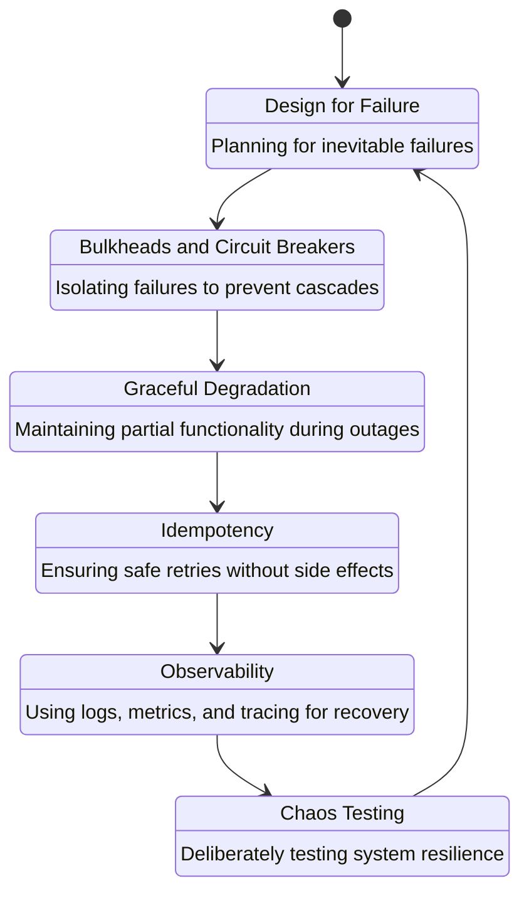

# Building Resilient Software Architectures

The following diagram outlines the key pillars of resilient software architecture, representing a continuous cycle of improvement and validation.

```mermaid
stateDiagram-v2
    [*] --> DesignForFailure
    DesignForFailure --> BulkheadsAndCircuitBreakers
    BulkheadsAndCircuitBreakers --> GracefulDegradation
    GracefulDegradation --> Idempotency
    Idempotency --> Observability
    Observability --> ChaosTesting
    ChaosTesting --> DesignForFailure

    state "Design for Failure" as DesignForFailure: Planning for inevitable failures
    state "Bulkheads and Circuit Breakers" as BulkheadsAndCircuitBreakers: Isolating failures to prevent cascades
    state "Graceful Degradation" as GracefulDegradation: Maintaining partial functionality during outages
    state "Idempotency" as Idempotency: Ensuring safe retries without side effects
    state "Observability" as Observability: Using logs, metrics, and tracing for recovery
    state "Chaos Testing" as ChaosTesting: Deliberately testing system resilience
```
