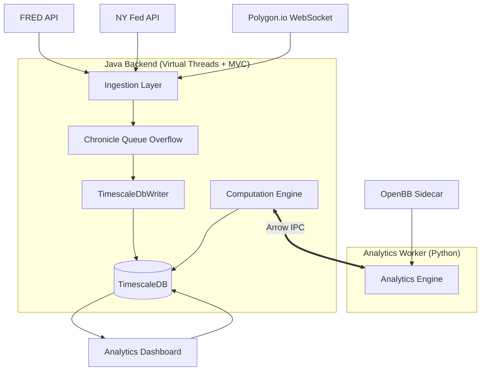
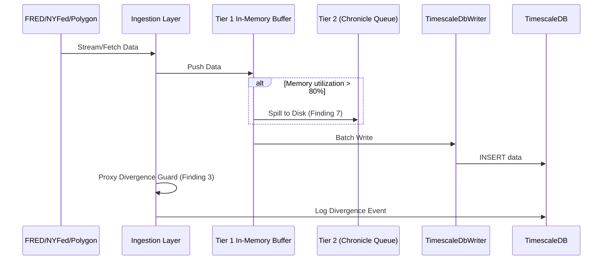
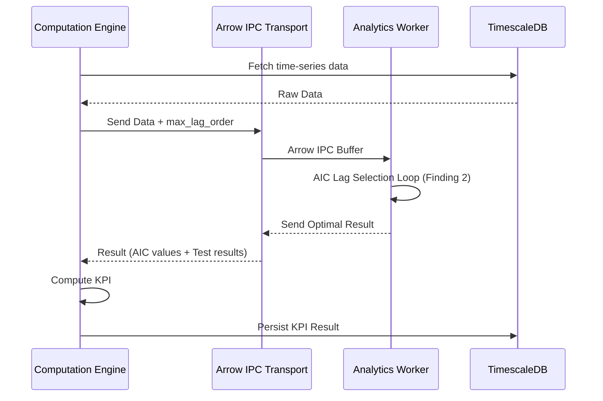
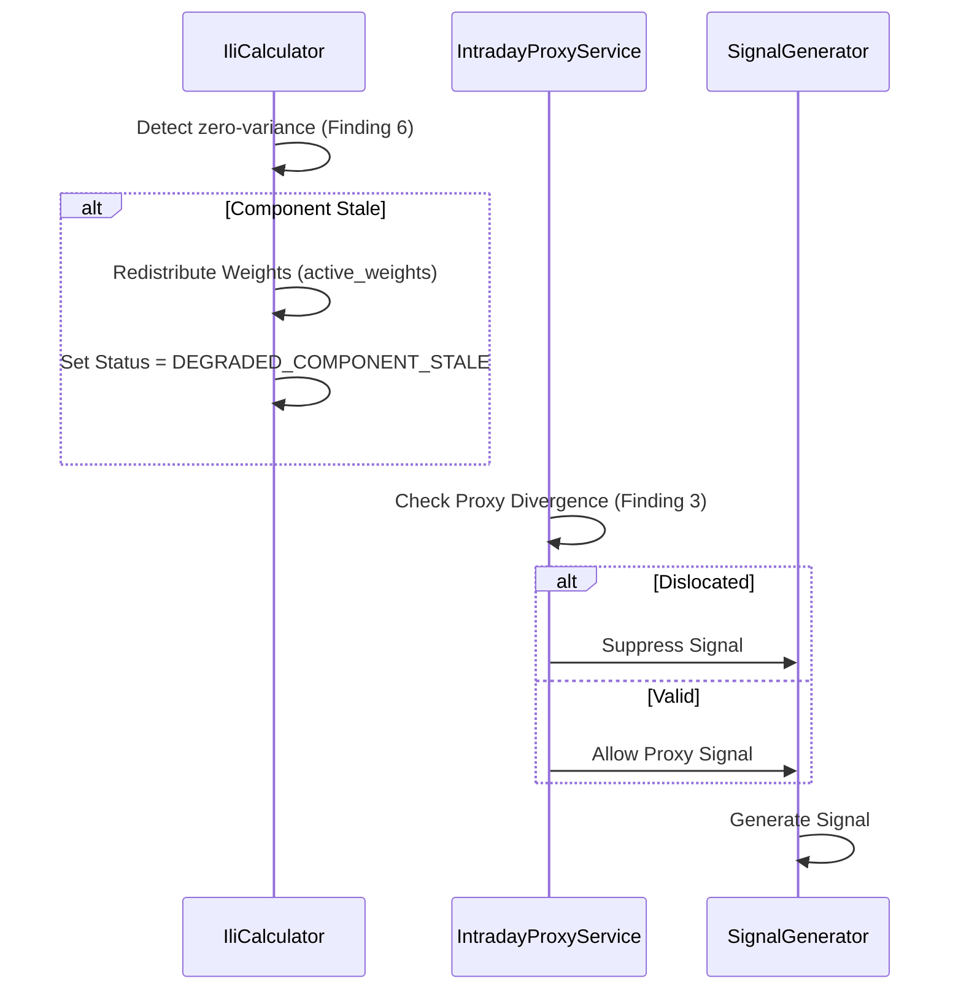

# Tickonomics v2 Architectural Diagrams

This document contains the comprehensive data flow and sequence diagrams for the `tickonomics` v2 architecture. All
diagrams are configured to automatically adapt to your environment's theme (light/dark).

## 1. High-Level Data Flow Diagram

[](https://mermaid.ai/live/edit#pako:eNptVF1v4jAQ_CuWJQToKKItNBBdKxHSSq36wV1RUS_hwSRLYjWxI8duy1H--zkxJKCrHxx7PTMe7zre4ICHgG3caGwoo9JGm6aMIYWmjZpESd7cbhsNn0WCZDGauT5DujUa6PpTgmAkQS6RBD1zJQLIzerN72vXKzo0nt4u0MnJFbplEeSScuZVI3RP1iAWhvL4egOh9_iK9OcblgFNebKOtMTu26UczWH5zIM3kP8RDCVXS-Pcx3fknSCHaDALUeuFCqm0-1ksgIQ5-oEeXiZtHxta0WqjhbKjVisQ3iQWnNEgAfRLgQL09A5ilfCPRc0zyJI0F1QnyZvRFPKAJOAuTeQAbQIl2nW8Vg112geoejThaeYVnZKkNHfNIspgcYzY6ZmgPu836Rjr2q0lDXI05-JNW2hN1zLm7CgHZsmrsUe7HQjrCzEWgn-g2-mkcJAqnSVSl6409fPy8uqrgn3t1A2gknnKgDkOeqYhBES7uucsOpGEJojsXbQN2CC9Y4K5B3vl2lx1AqKr75I8XnIiQrPuOiWpwoyz7ODIFXh36kPYLs-4gyNBQ2xLoaCDUxApKaZ4U1B8XP5QPrb1kIGSgiQmyT7bampG2B_O0z1bcBXF2F6RJNczlYVEgkuJrltaRYVOPYgJV0xi2zovNbC9wZ_YHo66Fxe9vnXa6w8HZ8P-WQevsT2wuqNzq2_1TgfnZ_3eyNp28N9y0153aA06GEIquXgwb0H5JGz_AcETSro)

## 2. Ingestion & Resilience Sequence Diagram

[](https://mermaid.ai/live/edit#pako:eNplU11v2jAU_StXlhCtRCF8NeAHHmhgqtR2rFSaNuXFSy7BWmIzx25Lo_z3OTGkbPFDkmufc889N9cFiWSMhJJOp-CCawpFV-8xwy6FLjNadsuy0wlFjn8MiggDzhLFslCAXQemNI_4gQkNW2lUhMByWD-vgsHTjzXGg41Mj4kUbfS9SDDXXIqK8Bk8sCOqNnppdjtUFfSF2_fQMm4eMZPqeDpqU76-otql8q0hjeDqbq-k4FGK8M2gwes267vi-iyUYR6xFINfbrMNDpb_Apfhyahrxc1i0RijsNUKWTZYo472EDDNHLRBWLSzQmFj8kuIe7JUw8my0TzlH6xu2AJmXschquVS2Fxn-1b4wNMUtISA57_has1FzEUC_sk9ivhSpkngTFNYsqrgOnIId2ARwZLC_dN29fwC8X_FXrq66MFGyfejrcPWllSzBF8MU_FnTePrNr1SeZDJJWv1ikKTHkkUjwnVymCPZKgyVoWkqHKEpJ7hkFD7KdBoxdKQ1CeitFT7_35KmZ3ZSppkT-iOpbmNzMH6OQ96s6tsp1DdSWO1qe_XOQgtyDuhs3n_9tab-ENvMpuOZpNRjxwJnfr9-dif-N5wOh5NvLlf9shHLer1Z_60RzDmWqpHd_3qW1j-Be4MKPM)

## 3. Computation & Analytics Sequence Diagram (with AIC Loop)

[](https://mermaid.ai/live/edit#pako:eNptk2Fr2zAQhv_KoU8tTYKbOnWiD4U5XiFbx0IXKBRDOeyLI2ZLniS3TUP--8720jZk_mB8uufu3leydiIzOQkpHP1pSGeUKCwsVqkGfmq0XmWqRu3hGz4joIO5qerGo1dGw1ddKE2n7GI5b9Ev1pqXLlhZ1K421p-yy63fcKsW11hued3Bg7G_yZ6ySdxyK1WRy7CkJE51D7Xihjc3SSzhlny2Ac_M0JFV5CBHjz2WxEOmWljCPb5A8p45asOKJfwinXcAXECFr08lFk_G5gdZzDDZi5efnMbNen1g-nfPfIYXc7jDgieUlHX7eGdMDWe3SudKFzA-Pyo8EvSzZmdYwj25pvQfUj5sdQk4a4c8Y9mw_wtYkfNgu4w7_4_hvrQ_WYLvy8XJri7JOsVNOPdvhBiIwqpcSG8bGoiKbIVtKHZtcSr8hipKheRPTY23WKaiy-g9l_JxPhpTHaqtaYqNkGssHUdNzUd2-BPfVy37Jzs3jfZCTiddDyF34pWj2ej6OgijyyCcTsbTcDwQWyEn0Wh2FYVRcDm5GofBLNoPxFs3NBhNI25AufLG_ugvQHcP9n8B6hf5Wg)

## 4. Signal Generation & Dynamic Weighting Flow

[](https://mermaid.ai/live/edit#pako:eNp9U39r2zAQ_SpCENKCG9zEiRPBCsHOSqC_aEoLIxA0--aIyZInS2lT4-8-WXbWZB3zH7JOd-_du9OpwolMARPc61VMME1Q1ddbyKFPUJ8aLft13eutRQm_DIgEYkYzRfO1QPYrqNIsYQUVGi1vloiWaMlZRHliONVSfY56UPJt7-KEVjSle3ewArVjCXwOX7FMUN7Et7trEKA-mNvVZr64urIrQTFoSDR6ByUvdlQxahWjs69MpExkaHLeAijXKJJ5IQU0OTTlXeq_2B4hZaVW7LvRgF6AZVtdojOaaLaDzWtrn_8TuQLHq02JvqB4cf04jxfxJrq_fbi_W9w9bVZP85tFiwSRHhfj-mFp3J-gaAvJz65rsU2rMjgpaXRUUsxKLhOqIf3QdKBr22eFmaJQUB762UngJaBnytl_gHPO5Wsn5AR7Kr91HeG6G4POgz2cKZZiopUBD-egctqYuGrwa-xGb42J3QowdkT4GjuPqC3UzsQ3KfMDWkmTbTH5Qa1-D5sitXm6-fxzqqxAUJE0QmMynTkOTCr81liDycQPwks_mI6H02Do4T0m43AwG4VB6F-OR8PAn4W1h99dUn8wDccetkNhB_C2fTXu8dS_AVxcC4s)

