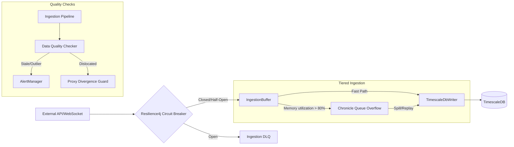
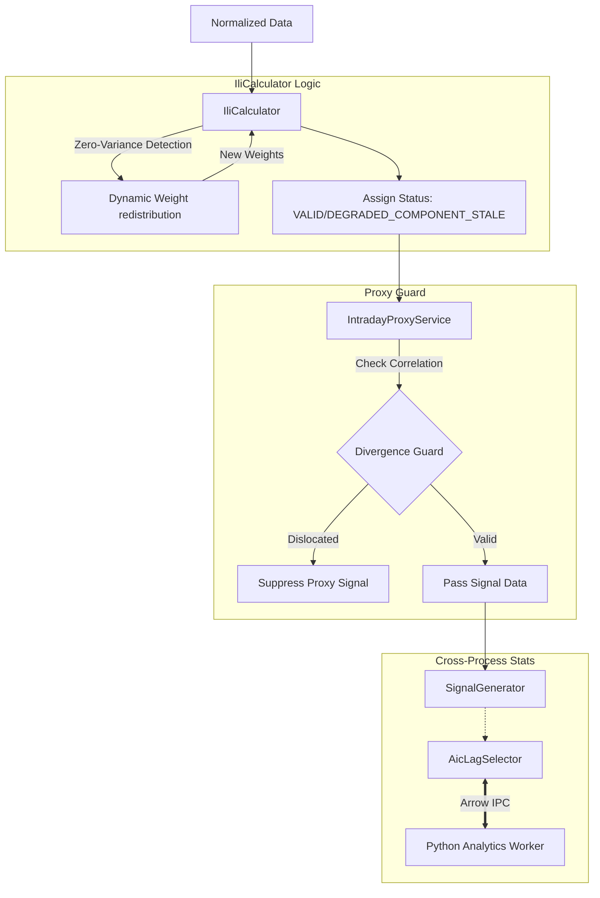
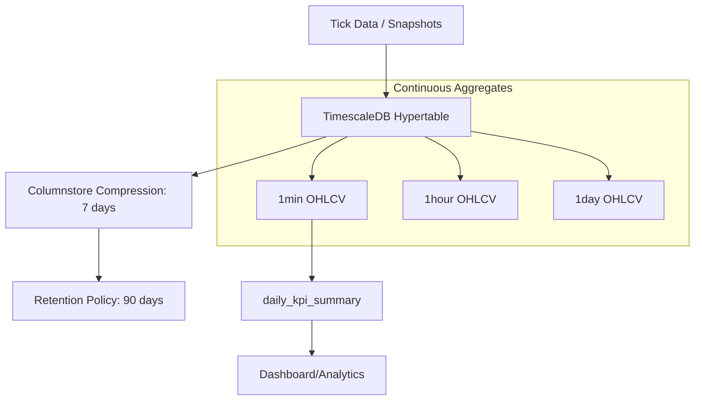
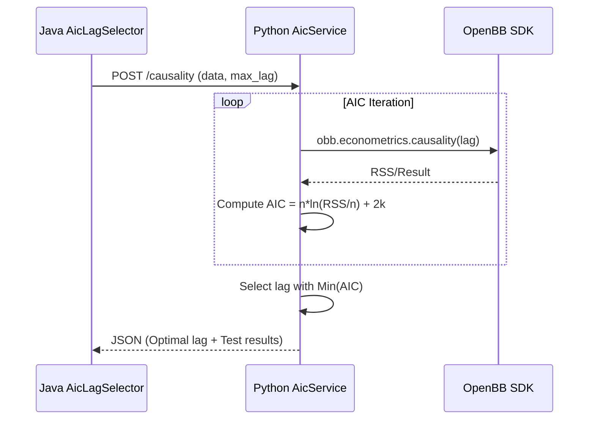

# Tickonomics v2: Detailed Component Diagrams

This document contains deep-dive architectural diagrams detailing the internal logic and component interactions for the
`Ingestion`, `Computation`, and `Persistence` layers.

## 1. Ingestion Pipeline: Resilience & Overflow Logic (Track 4)

Detailing the path from data arrival to TimescaleDB or the Chronicle Queue overflow buffer.
[](https://mermaid.ai/live/edit#pako:eNp1U9lu4jAU_RXL0kgzEkvYGshDpSaZpVIRW6VKk_Bgkgvx4NiRY3eghH8fExcKUscPV772OXc5vj7gRKSAPbyRpMjQ0zzmyKyF0DKB6PtOgeSEoYfpY_sFVguRbEEtUbN5jwL_MIeSMgo8gf4fFFCZaKqQL4FsQR5toMCvwdWkAF6h8GkWPfINlIoKfvKWt6iAiRLS9i_C1k3L8PV6DfKDZP13mrWlXtniY_xMQUKKLugYW8hpWabNM4ZcyD3SypT_Rupi7tHQ-VKhySvINRN_oyCTgtOEAZpp0HC5WH4e8QcpFZoSlVXoRVKjWvRMcygTwiBc2ZMr5jmY5S4Kylh7DgUj-zPdYoGn153aq5oU-tHXjwz-t_8pMtOEUbVHQQbJtrzW4yLS1YtMaQGMcrAvPAuikCiCbmLc9DEL3jtQpor2RCszDbJCDwykimo7JpxsPuWEtGQiIQrSCk2l2O2j2qKQGnE2p6FCPzWR6fIiBW6YKaUp9pTU0MA5yJycXHw4QWKsMsghxp7ZctBKEmb7jfnRUAvCfwuRn9lS6E2GvTVhpfF0kZpKQkqMbvnlVJqkIAOhucLeqFfHwN4B77A3HLXu7py-23H6w0F32O828B57A7c16rl91-kMet2-M3KPDfxWJ3VaQ3fgXK1OA0NKlZBj-__qb3j8B8RWIvU)

## 2. Computation Engine: Analytic Flow (Track 5)

Detailed flow showing how the `IliCalculator` integrates dynamic weight redistribution and how `AicLagSelector`
interacts with the Analytics Worker.
[](https://mermaid.ai/live/edit#pako:eNp9U2Fv4jAM_StRPgPHGKxQ3SZVLZqQGENj2qQVNGWtr0QrCXLSbQz47-emZXC620VqEyfPz_GLveWJToH7PEOxXrL7aK4YjUhYEU80rkQuPyF19oI1m1dslMuYvlDkSZELq3FReVR_U7xURHP-B4iNdSaTOa9Q5aBjx7d7AtTNB4FSqARYBBYSK7XasWijxEomcT2zR5DZ0jKEVBqL8qUoYYsj4wHnWCfwXjuYXRnr78AzK2xh4sAYmana8tlDMB5FP6Lh9V0QDaPn8PZmejsZTu6fZ_fBeFhHA5WeJl35OtIp6o9NPFIWRSo2zpoBvskEvpPJYdh1ITA9lafadqmES0heWagRgbSspJFvgBmQYNvjsiLZnwhyPHJEkTS5ToSFdMdmxXqNYEx8WNQRZySGyBffkzxQRZD_VJBv-as9qgr5pzwO5RR3yLiarkEB_q9-QtTGNOlWSXm7UmNzKlAdttki4rHI4kAmNM0gp_L5Ii0H7bKfl5dXuwBRv7PRNNyxR42vgPF0Y5dasYCINlYmpt4_psEb1Bcy5b7FAhp8BdQQpcm3JWTO7RJWMOc-LRUU9Oh5dcW52pPrWqgnrVcHb9RFtuT-L5Ebsop1Si8RSUH5rr52kYIChrpQlvsDz3Fwf8s_uN8ftC4u2l3vrN3t9zr9bqfBN9zvea3Budf12me98063PfD2Df7pgrZbfa_X4NQtpMdN1eSu1_e_Ac3JRRo)

## 3. Database Persistence: Migration & Aggregation (Track 2)

The lifecycle of data within TimescaleDB, highlighting the interaction between raw data, continuous aggregates, and
compression policies.
[](https://mermaid.ai/live/edit#pako:eNqFUstu2zAQ_BViz4ojOXZk8xAglQ45tGiRBD1UMoK1tJWIiKTAB1rV8L-XFhPXPRTlgeQOZ4Zc7h6g0S0Bh87g2LPnslYsjEf8UT2L5pWV6JBdsyeFo-21szt2dXXHHqaRTCBIsg0OVH6IiMP9QLvoEGfr99G4hkIrJ5TX3rL7rjPUoSNbQ-Sdxmwx24fzTFaZFIp9fvhYfN39i9RXWa-9-Q-rrbIWp79IpNrLZ_7hF1qOhqytCj14qazThs6g0IqznAUz--bzfjJrH8mhUFVYKKSqFfuiB9FMnG3TS02c5xxnWYlimJ68lGimqj0FL6-jeLEReRNdkmJiCofJicZWJdp-r9G012dsB0koqGiBO-MpAUlG4imEw8muBteTpBp42CryzuAQK1GrY5COqL5pLd_VRvuuB_4dBxsiP7ahcqXAUFh5Rk34UTKF9soBz9JsNgF-gJ_AN9vF7W26yrN0tVkvN6tlAhPwdb7Y3uSrPM3WN8tVus2PCfyab00Xm3ydALUi_P6n2J5zlx5_A9Ym2Ss)

## 4. AIC Lag Selection (Sequence)

Detailing the AIC loop interaction between Java and the Python worker (Finding 2).
[](https://mermaid.ai/live/edit#pako:eNplklFP2zAQx7_K6Z7SEUJaUtJaGhKUF7KxRIQnFAmZ5JZaS-zMsRml6nefk1CmiXu68_3uf_b59liqipBhT78tyZJuBK81bwsJzjqujShFx6WBBHgPCX_hcCXK77zOqaHSKP2ZzAYy25mtkgObk34RJX3m0oFLO5LX15DffCvkhCSnl5cZgyzNH-Cs5LbnjTA78CpuuA8tf31qeD2b2EapDq5uN3BrSHMj1LvGYJnTSRmo5-eASiVVS0aLsg8-JL1_OoOlp1Pj-zw_u6feNuZ_LZfaqLazhsaOX0F-aaQ30HIGJ7D4NeEkq8l5r5nmBK4X_BFmC3dCeq5-doQclTBI8vQHeGlnRMubET6BB-oN6PEm_Qx9rLWokBltyceWdMuHEPeDUIFmSy0VyJwryRrNmwLHjDy4UjfvR6XaY7VWtt4i-8mb3kW2c6M9fvzHqXYPIb1RVhpk83A5iiDb4yuy1Tq4uAijeB5Gq-ViFS183CFbxsH6PI7icL48X0ThOj74-DZ2DYNV7ASoEm5h7qaFG_fu8BdnUMVY)

