# Tickonomics v5: Comprehensive Architectural Diagrams

This document contains all data flow, sequence, state, and deployment diagrams for the tickonomics v5 architecture.
Diagrams are written in Mermaid syntax and rendered via mermaid.ink.

---

## 1. System Topology & Data Flow (High-Level)

End-to-end view of all data sources, processing layers, and consumer applications.

[![](https://mermaid.ink/img/pako:eNqFWNty4zYS_RWUqpIaV6zMpnaTh61kqiRS0iiRbEnU2jux8wCRMIU1RTAgaY82k3_PaQC8iZyJHwQQQDca3adv_mMUqkiM_s1GsebZke39x5Th76uv2OxjIXTKE-bzgrNAlToUud2d72b-w-OIBjbZLH886Lfv3szm89012-0212x5u5tes_vJyltdPY5-s0Q3H-YiAtXNB4ZJQxfcEt1-4eF3an7346lMkoZyo5JzrFLQutm3Urk7fy9lcWb3wTW7zQqp0pztZsG-IfVlznO8A7T_CRYBe8sW_sQLLHW1ySaJ0EXeUM1ClaqTDEFVTZnHE5FGXJPgzZvEa05PwgDWgUgLecKPZT-X6XS227NlmpWFZV4rd5nGIieB2YqfhW7Uysbjd81uS3NDG04dQ1v12wb26jcN3UVPuVi3O3l5sBh5HDXSf812IpeJFGko3FNG9jj91ece2jS3OjxiqnmhdK3JznEjwFyLyCPOBUGt_vgCxc153iJpfX2BxqnwPm_QdZ__LVWl3fqyasEg6W_JyQA1aWWNCmAt6oa-eb9h4PlrUOKXTSKekZmd7ltXtt5f0TSb9VObrWaT-NLy1qOXwfu3JU_gZ95RhM9CG3R_w3yxU2UayTRm37CN0FJFMsSpjhBbjzh9ehxN8nMaMo6X8gRHPrFARiLk5JiTslDAD-KQrlY7PNyaY7QT0BfQU4ZGnetgRty2XvsB9lY2LZ-ejOvvpYD-3Ld1Tu-oVSrDRLBtKUpx1bnRHjQ87rUsHI-TyEPYyD_YNctnGYlTpgooGdGrTJ6PgkdjmauEFyJquMKylYCW2sJo-vCmzXlqeb4_Z0ARPyQih2q9SRyD0VUV0abWZOqUDXjmz_yFsymHmdKIvbmTuoDp2P6oIRYxCzJNBlvfeVdtRyVuBCgMZcGNYmdpLFNhBfrhX-aESvHM_OoCmq3bPaUF28hMJCBt8zd4VPpEbokBaPq_uSUQ-kWG7pZfx3kIBtessOZKlHo-4Cld2xhvWi0JNwR9-SKWiYTvhGVCAcVF9nPKKcC9ChkfCwZuEpCRh5Iu7fPbiRg2eCBw0cQXhQhrXovJznuP6O7d3IxXwX6N6RZx-i37ZXwSPM377AIZI2-CnZ0sRCp0IxtcJaREkYix5unzNaSjS8fcPafPzwQVejCNa57y-MLVW-iqrGkDInRtg_lqaUb7PjO1spmp4fsZk758bwqBNIJB1ioqgclLw67EC94Xk_6qqWV-IaWJO1xqE2pp3GtO4cMira_FKptutKJMHAA1NBV5rqoYVJ-5I4eTFKQWJddRj9nsowgnEOmcy9wBncMmUDftGFhU285KPM-xy15yBv_Twnz1TbNRunhSiVSTJDYZxH1aK5Fk2BAHzXuUa66f1Qto7CQoVOa8oW9_EiAmBBEI4lQhk4TNohUYptWiYCeZypPzrr64s6cnxGgE27O7WBTN0hoB8TIlG--Q-fNGC3LeairLE-X9CMHlc1QLLcRzvpKH-iYYK5dQOYyEZc312TmYOcmQGiAFzFjqC0VfwLsCcwW2dqaoMW0ANrjTwdXgiTZYhpm3rD54wNq0L3JjtP5eY4j-XqX3_k6t5raGFgZYG66BE5kZLGCJqnmUaUMow65Lr0GZZYR2xLdJdJKFTdX0sF4ia0WJzbk4ImcYpeHOnN0rWFyzN3NURSiYO8nG7hGU6-OtEDAYhQJKSoR66NfJ3wtDE39OPP05FfmIrAiSmN2ugr4_LamwwS-qphj8EmFqiT6EOSrV4IWCj00CNnz2zvmrOoF0k0Q_pqmDMomBRsTTtBBoLHSivoT3bjSeRBSKP6cE13NQxey6jxrufWEmJo3SAF_6KMMBFfiSu3jz0LVCs-EC5nY7zhKFKmjiza-RglLgLaa2oB-FEKznSPQhsAGuTehm1SqSQo9ojwYUSd3WzMhEImktuVoMD0G8_u9iqiAZTckUA_n5yKnaCd5PNvD1LOEy5QcjQe_oFmBNqGvdjs2MTRUKq42G7vshb09tq3VIKhhNF1v7BHRmt3pkXqlRxAAKmqT6IAWuMWvMLhr9qNS-8UYkuUrHgRSxSPpP85QETay567o632yPHsSZCx6HAqTxk5_VEbWMSAci7wUkTXXx408_vfs00Vq9suXG--R8eiAyUC1aCGNSNDEw1itOtlE7JbBWpwZKgXvy6nuePAMcr0jtdygDol7ruPYMKmp_om6cfKxzyBcJp8RnRt8m_rpipLXxP0BnZ991FREkMstsjQO8licRUMEeVcuds55WeX5nCkAzNWDti91Sqavpp3v72Uok1dJ0b7uReedz7XU-jeSdlVq-9mIl34C1fHEi1VV9Q53n2gbb8MxEbzN-voS7I2JSl-XVYtVW63ZXl8muydyJDEe7dsOO61D8jljM1nFot9Je1Rak6EP0YAfWKRMy14sZee2-mVr9bXeXS5UwA9qbawIg7mlpy-f58aCA206-q1crp_5YfPu_nH33PVo0_5-2n84zSkuXReeKm5abam07wxNiccnm6gsoq--2q6b4H9pwx901o2s2Ogm0bjLCfwv_GBVHVLf0f8NIPPEyKUZ__vkXXKlGvg==)](https://mermaid.ink/img/pako:eNqFWNty4zYS_RWUqpIaV6zMpnaTh61kqiRS0iiRbEnU2jux8wCRMIU1RTAgaY82k3_PaQC8iZyJHwQQQDca3adv_mMUqkiM_s1GsebZke39x5Th76uv2OxjIXTKE-bzgrNAlToUud2d72b-w-OIBjbZLH886Lfv3szm89012-0212x5u5tes_vJyltdPY5-s0Q3H-YiAtXNB4ZJQxfcEt1-4eF3an7346lMkoZyo5JzrFLQutm3Urk7fy9lcWb3wTW7zQqp0pztZsG-IfVlznO8A7T_CRYBe8sW_sQLLHW1ySaJ0EXeUM1ClaqTDEFVTZnHE5FGXJPgzZvEa05PwgDWgUgLecKPZT-X6XS227NlmpWFZV4rd5nGIieB2YqfhW7Uysbjd81uS3NDG04dQ1v12wb26jcN3UVPuVi3O3l5sBh5HDXSf812IpeJFGko3FNG9jj91ece2jS3OjxiqnmhdK3JznEjwFyLyCPOBUGt_vgCxc153iJpfX2BxqnwPm_QdZ__LVWl3fqyasEg6W_JyQA1aWWNCmAt6oa-eb9h4PlrUOKXTSKekZmd7ltXtt5f0TSb9VObrWaT-NLy1qOXwfu3JU_gZ95RhM9CG3R_w3yxU2UayTRm37CN0FJFMsSpjhBbjzh9ehxN8nMaMo6X8gRHPrFARiLk5JiTslDAD-KQrlY7PNyaY7QT0BfQU4ZGnetgRty2XvsB9lY2LZ-ejOvvpYD-3Ld1Tu-oVSrDRLBtKUpx1bnRHjQ87rUsHI-TyEPYyD_YNctnGYlTpgooGdGrTJ6PgkdjmauEFyJquMKylYCW2sJo-vCmzXlqeb4_Z0ARPyQih2q9SRyD0VUV0abWZOqUDXjmz_yFsymHmdKIvbmTuoDp2P6oIRYxCzJNBlvfeVdtRyVuBCgMZcGNYmdpLFNhBfrhX-aESvHM_OoCmq3bPaUF28hMJCBt8zd4VPpEbokBaPq_uSUQ-kWG7pZfx3kIBtessOZKlHo-4Cld2xhvWi0JNwR9-SKWiYTvhGVCAcVF9nPKKcC9ChkfCwZuEpCRh5Iu7fPbiRg2eCBw0cQXhQhrXovJznuP6O7d3IxXwX6N6RZx-i37ZXwSPM377AIZI2-CnZ0sRCp0IxtcJaREkYix5unzNaSjS8fcPafPzwQVejCNa57y-MLVW-iqrGkDInRtg_lqaUb7PjO1spmp4fsZk758bwqBNIJB1ioqgclLw67EC94Xk_6qqWV-IaWJO1xqE2pp3GtO4cMira_FKptutKJMHAA1NBV5rqoYVJ-5I4eTFKQWJddRj9nsowgnEOmcy9wBncMmUDftGFhU285KPM-xy15yBv_Twnz1TbNRunhSiVSTJDYZxH1aK5Fk2BAHzXuUa66f1Qto7CQoVOa8oW9_EiAmBBEI4lQhk4TNohUYptWiYCeZypPzrr64s6cnxGgE27O7WBTN0hoB8TIlG--Q-fNGC3LeairLE-X9CMHlc1QLLcRzvpKH-iYYK5dQOYyEZc312TmYOcmQGiAFzFjqC0VfwLsCcwW2dqaoMW0ANrjTwdXgiTZYhpm3rD54wNq0L3JjtP5eY4j-XqX3_k6t5raGFgZYG66BE5kZLGCJqnmUaUMow65Lr0GZZYR2xLdJdJKFTdX0sF4ia0WJzbk4ImcYpeHOnN0rWFyzN3NURSiYO8nG7hGU6-OtEDAYhQJKSoR66NfJ3wtDE39OPP05FfmIrAiSmN2ugr4_LamwwS-qphj8EmFqiT6EOSrV4IWCj00CNnz2zvmrOoF0k0Q_pqmDMomBRsTTtBBoLHSivoT3bjSeRBSKP6cE13NQxey6jxrufWEmJo3SAF_6KMMBFfiSu3jz0LVCs-EC5nY7zhKFKmjiza-RglLgLaa2oB-FEKznSPQhsAGuTehm1SqSQo9ojwYUSd3WzMhEImktuVoMD0G8_u9iqiAZTckUA_n5yKnaCd5PNvD1LOEy5QcjQe_oFmBNqGvdjs2MTRUKq42G7vshb09tq3VIKhhNF1v7BHRmt3pkXqlRxAAKmqT6IAWuMWvMLhr9qNS-8UYkuUrHgRSxSPpP85QETay567o632yPHsSZCx6HAqTxk5_VEbWMSAci7wUkTXXx408_vfs00Vq9suXG--R8eiAyUC1aCGNSNDEw1itOtlE7JbBWpwZKgXvy6nuePAMcr0jtdygDol7ruPYMKmp_om6cfKxzyBcJp8RnRt8m_rpipLXxP0BnZ991FREkMstsjQO8licRUMEeVcuds55WeX5nCkAzNWDti91Sqavpp3v72Uok1dJ0b7uReedz7XU-jeSdlVq-9mIl34C1fHEi1VV9Q53n2gbb8MxEbzN-voS7I2JSl-XVYtVW63ZXl8muydyJDEe7dsOO61D8jljM1nFot9Je1Rak6EP0YAfWKRMy14sZee2-mVr9bXeXS5UwA9qbawIg7mlpy-f58aCA206-q1crp_5YfPu_nH33PVo0_5-2n84zSkuXReeKm5abam07wxNiccnm6gsoq--2q6b4H9pwx901o2s2Ogm0bjLCfwv_GBVHVLf0f8NIPPEyKUZ__vkXXKlGvg==)
[Local Diagram 1](images/diagram_1.png)

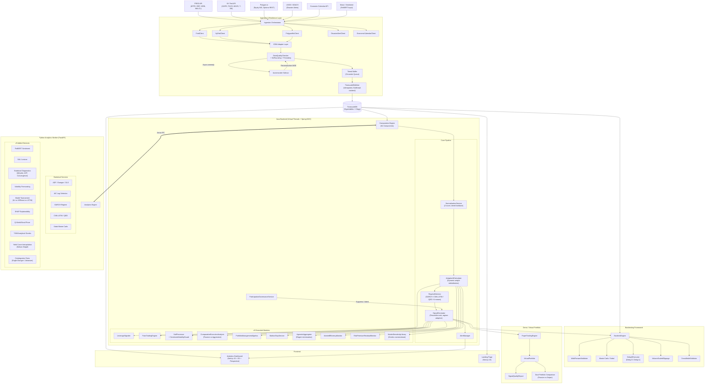

---

## 2. Ingestion & Resilience Sequence Diagram

Detailed sequence showing CDM transformation, quality checks, resilience patterns, and persistence.

[![](https://mermaid.ink/img/pako:eNptVdtO4zAU_JWjPhWpAe1rtUJKk4IqaOkFdrUSEjL2aWPVsbO2Axsh_n2P4xQCbR-ayJ6Zcxs7bwNuBA7GMHD4t0bNMZdsZ1n5qIF-FbNeclkx7WFjassRmIPpP49WM9UtHUMzJZEeBO1I3cLwyqK4WDRX9L80qtkZfXaCnc8DNTxSwSqKBbesQXuMXGUBmDPPVjVT0jdZgXx_CplOAzKtvaEaqWILGymQsxPQfN2K4trUWki9gwtYopVGEMA3cCWVPxVhUm-3JBsSL6zRkiuEVY01djvHjN9W-si4lyU6zhTmz3HxRFaTr8DJo46g2OHk8jL2eAzL2hUhZ6NU25oIi7s92DVqtMwjPDzMcpgJLCvjqTkN3GDznZPPx7Bmr7BGVxntEIYuhnUVcrmVHHxTYTdLQh84c1aBN5CJck2hNppVrjCesqOVe8n38e2u8tLow25fZJWN27egLkC01cT9VUbb6XQMqWs0B6ZNyVQDPBgAhqm15hVmy6xLKZ0mndqbdE8deAQWOVXjbc1DAk-lw_eDPlNkmk40R4_co4g7H9GD3JViO9g8bJbT7P4pXdzN09s_EYbKBd8j070pfOEumXPgySz1rug4WnypL1-PoXN24rihw9OeCvGhl6871KY0xhdgg2cTTy6BF6NqerhK7tF9Q0cPU407Q3YrSprfj8SFZgioPr3eY0UPj2NBI-iS6Q9kQe4B80KyB-x1lmwt0uJ2mxRITnDeWLbDn8_24tJoEEhhyBYCFr_mh4QPclGEIscDMYYJ87wAYZnUMHyu1Z4kRSKdUUGim3ME91jthQCy5-79wd1hwnldqTaHT9P3ZHp1b_ayguGHjj_rDXmBryfp1OvJIe_ZYjNd339C8knSyzLNbo4M8NnPiBoFsUxaXksPzxYZ3XNQWROsSdfV5Lxt6-3NNXBGpwAc2hd01HO6LdpBtfuvBeoPtnRwt5wuzgcjGJRoSyYFfQneBr7Asv0mCNyyWvnB-_t_SIwHcg==)](https://mermaid.ink/img/pako:eNptVdtO4zAU_JWjPhWpAe1rtUJKk4IqaOkFdrUSEjL2aWPVsbO2Axsh_n2P4xQCbR-ayJ6Zcxs7bwNuBA7GMHD4t0bNMZdsZ1n5qIF-FbNeclkx7WFjassRmIPpP49WM9UtHUMzJZEeBO1I3cLwyqK4WDRX9L80qtkZfXaCnc8DNTxSwSqKBbesQXuMXGUBmDPPVjVT0jdZgXx_CplOAzKtvaEaqWILGymQsxPQfN2K4trUWki9gwtYopVGEMA3cCWVPxVhUm-3JBsSL6zRkiuEVY01djvHjN9W-si4lyU6zhTmz3HxRFaTr8DJo46g2OHk8jL2eAzL2hUhZ6NU25oIi7s92DVqtMwjPDzMcpgJLCvjqTkN3GDznZPPx7Bmr7BGVxntEIYuhnUVcrmVHHxTYTdLQh84c1aBN5CJck2hNppVrjCesqOVe8n38e2u8tLow25fZJWN27egLkC01cT9VUbb6XQMqWs0B6ZNyVQDPBgAhqm15hVmy6xLKZ0mndqbdE8deAQWOVXjbc1DAk-lw_eDPlNkmk40R4_co4g7H9GD3JViO9g8bJbT7P4pXdzN09s_EYbKBd8j070pfOEumXPgySz1rug4WnypL1-PoXN24rihw9OeCvGhl6871KY0xhdgg2cTTy6BF6NqerhK7tF9Q0cPU407Q3YrSprfj8SFZgioPr3eY0UPj2NBI-iS6Q9kQe4B80KyB-x1lmwt0uJ2mxRITnDeWLbDn8_24tJoEEhhyBYCFr_mh4QPclGEIscDMYYJ87wAYZnUMHyu1Z4kRSKdUUGim3ME91jthQCy5-79wd1hwnldqTaHT9P3ZHp1b_ayguGHjj_rDXmBryfp1OvJIe_ZYjNd339C8knSyzLNbo4M8NnPiBoFsUxaXksPzxYZ3XNQWROsSdfV5Lxt6-3NNXBGpwAc2hd01HO6LdpBtfuvBeoPtnRwt5wuzgcjGJRoSyYFfQneBr7Asv0mCNyyWvnB-_t_SIwHcg==)
[Local Diagram 2](images/diagram_2.png)

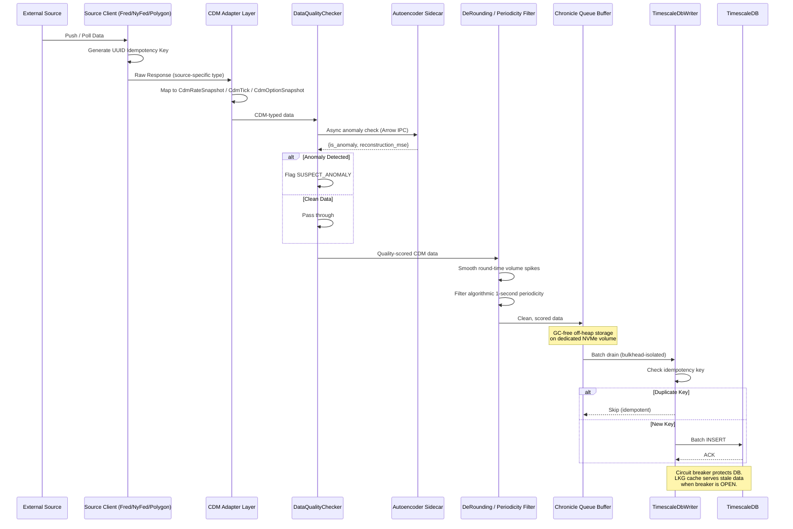

---

## 3. Computation Engine: Core Analytic Pipeline

The primary data transformation pipeline from raw CDM snapshots to actionable signals.

[![](https://mermaid.ink/img/pako:eNqFVmFv4jgQ_SujSHuCbrldaLunrvZ6Cklp0QLtAWq1wAqZZAoWJolsp12u2_9-4ziUpIWWD2BsvzczzzNjPzpBHKLzFZy5ZMkChv4kAvqodGYnJo7PNIM-asnxnomJYzeYj98cVybOkK9QBUyg35w41Z9Qq539njiaB8tpSNBDkEzjVEUsUYtYq4nzG1qog8XYUmdjlBPnZ5E4Z1kmfCpjIXg0nwaxlCiY5nH0bSY_nVU8dz6vPtNt0dlfQwCe3522IzJEg9pwnWAI7ShJ9bMxjMJJ9CriXixXTPD_MltQ8eJVEkcYaahXi-Fb9syQQYxfAAco73mApcDMhjy0EfwNlV9Qg0HXrcInGAx9__zGhDOqE9VoKmVi4xRxvJyxYPkVGieNsLqTEEaNDKQSiSx8ifvyeS_sKIPdx-KVrSJmt07tThs8JoJUvFKqUVJqVM-M0X6y5oYs0fwe24JvwHH5-EeNzfbC3NHrOWPfivlQP8gEg4_w0DjYyEDiPhwdZNEZXcngDRNj6zeNUqTtA810qkrmt7Q91oPgOaZJ2qifNkBiyBVVwyzVaGhvkc8XekBBIHHbfxgWZq2yM6aMPSoUPjMV8a66xjNSlUmu1_AHeNv0Lwit4Kj2ZV9Wun7L6O23oMTlLTBYWqfciIk1laqC21guUZazpEjV9gxV24MOm8MABQYUmiXRCx5BIHhBo11sxg9DdSFZNEdJdPmIcihVJAu5NkSlyyCyWADt9M0qY6p8K9F5NOcRbvsEKT90ax0-A0Gp9570fZxTUwMfNYX5IrP_Kqltcypzw4LGG7QFv8jsnNhm13W_3XX7P0wOXTAZLPpGErfvXebb9iNdocE1OK_X6wyGXRN7r1czQ7hczyQP38Y2Dfbfc59w9A3XsabIOMVxi0Lsh7aYEKY5GPT3LrJIEcH3WjaCCo80Ssqn8qnbyAoCXaX6WSPwBFOK3_Gg0NY7V7fUDntX_a7bocFl--LyRVraoMuc22UT0Z4l6_Su1T0lyOcUEFxghPJVizvdlwgWNd7Ac_TOTCD7Bch2NTdslq4D3WfRkuiuUQbmnATWzAwMFxLpShWhssI10zV8g5MPh6Y-BZzB6cmHsnI5V8bb4oLOy5ygHVFbYDwqbc-32O3mUurQ7VBjC9Nam5zRmddrIVtDfHenUFf3Y83d1KUmcROb6swqveL6fXLx85_1kzeAR1lVU4jxA2l_vIAQ71gq3rJ1nEGU3soDlcYvoMbCV6btUkNX-r0GcBHfm1yOAqTO63OVMPOkKLbdev0QGselFCi6QQTmxJik5sqTLHe2nLteBrRqG2244vrRfFNhzAT-81RohmYtr8UfmL2kXIHS1FP222URM_00b8KuN2xf9dxm57zcUgssvdiQDNKE7ktlcmEzpH7ZieeUpUzF0S6xMoOZx_Tsy2aeoXbSOQRnhfQe4iE9Lx8dvcBV9tDMj9B5evof5nwuaA==)](https://mermaid.ink/img/pako:eNqFVmFv4jgQ_SujSHuCbrldaLunrvZ6Cklp0QLtAWq1wAqZZAoWJolsp12u2_9-4ziUpIWWD2BsvzczzzNjPzpBHKLzFZy5ZMkChv4kAvqodGYnJo7PNIM-asnxnomJYzeYj98cVybOkK9QBUyg35w41Z9Qq539njiaB8tpSNBDkEzjVEUsUYtYq4nzG1qog8XYUmdjlBPnZ5E4Z1kmfCpjIXg0nwaxlCiY5nH0bSY_nVU8dz6vPtNt0dlfQwCe3522IzJEg9pwnWAI7ShJ9bMxjMJJ9CriXixXTPD_MltQ8eJVEkcYaahXi-Fb9syQQYxfAAco73mApcDMhjy0EfwNlV9Qg0HXrcInGAx9__zGhDOqE9VoKmVi4xRxvJyxYPkVGieNsLqTEEaNDKQSiSx8ifvyeS_sKIPdx-KVrSJmt07tThs8JoJUvFKqUVJqVM-M0X6y5oYs0fwe24JvwHH5-EeNzfbC3NHrOWPfivlQP8gEg4_w0DjYyEDiPhwdZNEZXcngDRNj6zeNUqTtA810qkrmt7Q91oPgOaZJ2qifNkBiyBVVwyzVaGhvkc8XekBBIHHbfxgWZq2yM6aMPSoUPjMV8a66xjNSlUmu1_AHeNv0Lwit4Kj2ZV9Wun7L6O23oMTlLTBYWqfciIk1laqC21guUZazpEjV9gxV24MOm8MABQYUmiXRCx5BIHhBo11sxg9DdSFZNEdJdPmIcihVJAu5NkSlyyCyWADt9M0qY6p8K9F5NOcRbvsEKT90ax0-A0Gp9570fZxTUwMfNYX5IrP_Kqltcypzw4LGG7QFv8jsnNhm13W_3XX7P0wOXTAZLPpGErfvXebb9iNdocE1OK_X6wyGXRN7r1czQ7hczyQP38Y2Dfbfc59w9A3XsabIOMVxi0Lsh7aYEKY5GPT3LrJIEcH3WjaCCo80Ssqn8qnbyAoCXaX6WSPwBFOK3_Gg0NY7V7fUDntX_a7bocFl--LyRVraoMuc22UT0Z4l6_Su1T0lyOcUEFxghPJVizvdlwgWNd7Ac_TOTCD7Bch2NTdslq4D3WfRkuiuUQbmnATWzAwMFxLpShWhssI10zV8g5MPh6Y-BZzB6cmHsnI5V8bb4oLOy5ygHVFbYDwqbc-32O3mUurQ7VBjC9Nam5zRmddrIVtDfHenUFf3Y83d1KUmcROb6swqveL6fXLx85_1kzeAR1lVU4jxA2l_vIAQ71gq3rJ1nEGU3soDlcYvoMbCV6btUkNX-r0GcBHfm1yOAqTO63OVMPOkKLbdev0QGselFCi6QQTmxJik5sqTLHe2nLteBrRqG2244vrRfFNhzAT-81RohmYtr8UfmL2kXIHS1FP222URM_00b8KuN2xf9dxm57zcUgssvdiQDNKE7ktlcmEzpH7ZieeUpUzF0S6xMoOZx_Tsy2aeoXbSOQRnhfQe4iE9Lx8dvcBV9tDMj9B5evof5nwuaA==)
[Local Diagram 3](images/diagram_3.png)

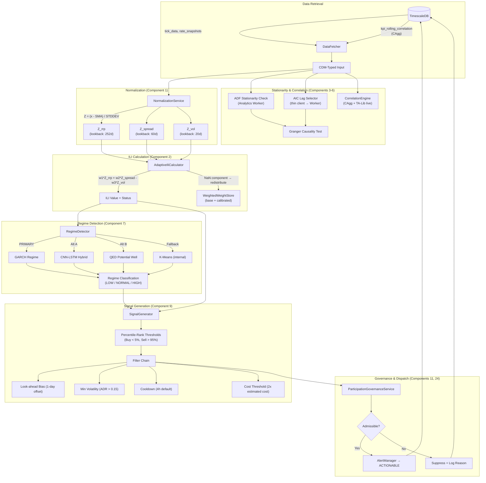

---

## 4. Signal Generation & v5 Extended Modules

How signals flow through v5 enhancements: sentiment, leverage, pairs, stops, and execution analysis.

[![](https://mermaid.ink/img/pako:eNqFVu9v2zYQ_VcOAla0WIw43Yd1xdBNtRU3gB1rlushiIeBls4yF4rUSCqtl-Z_71GUZKuLU3-wzvzx-O7e8VkPQaoyDN5CkGtW7mA5Xkugz0hpvF0HCc8lExOUqJlVGuaVLSv760afv3sZjpZX8-vw_TSCc0g-xvEiSpJo_God_LWWHsVUGw9LSCgtL-gLYl6i4BLhZaxVqQwTBoa_nMHFkLb6fe5zjZ8MMXAPuETMCBYGg3dwyeX7aLGkqSaCkCju_0PtacV7u1MS_lT6DrUncwxZY0zxc8IEdwmG0yv3k6dKfnd_e6CDcPuJf-owmhCNUQ2Jn4c_wBUhn8NPFHW59-EaFj24w6xT4MRUO-KnCXdSMZ3dHhV5pQSzXHC7r6cawbJ_KmNBY05rwO40mp0Smemz6vDaajPhu4Dwwyp36JiBH-o2osye0HyK99Q3OcILiJW2WyW4OqgOwzc9wZP4xqUQ38Dr4XCQsT0ks7BVnaDoyNsDpieA-puKulVuwxdaGa2iRTiJ_p5fkw7zy8t18OXAg6C6eMYkIbrMQpHjRjNfrwVumGAy5TKHH2HGdM5lv1adRh3Uc-WIGdcGVqj5lqckD3XZyWJ8lJzyNO4ORv9WpGM30lakRrttUJeaZUQzkkQRPfsZl4OMG0sJIBTMpjtacIL-SCtjRjtM7x7Wgevbe-Pxa6ixOzjH39bB42GvT6a_-Qi5G2vEuEHjyj_mRiifO1H_wPMdZIchKLXasE3dt32i38JdK4c2UnLLddH5FKR-oDaL55SIPmNa1Se-gMSq0vS86M3_vKgrlNs4UkVJR7oHI1ek4nRwtRMZbhonYcbQrCtmmOd029yvvgItXqNovaLWtI463A9MZqI1uCkvuIXfYUsKUMV4-hxmIslttatQHTyNSK19hw6y84QTfeIWqntC84ErXYL6nih4oMQyi4MMSyq7s3ryVWtOYK2UpYYkLB-MhMt5y1tO89LRJE1n01bWukdefUfaBTd3TlWUhpM27uYcaXtxQdq-PqHtlq4lR5numwTRHoZmSnLbuntzQ8Il8MJbBELOyhOJOkaxRtembcirYoGGZxUTPeB48ElpkTnwP3x4AnOiEe9Mx_Mo2ykn_9L71sFKNRijsOwMFk6aCSsKiunvIWdPVvLI7-uDxlg4q3QPMtEV15Y4H9ldC3Hw93ZX-x5RS9eNBmcQFEha8oxeOh4CuyPfda8fGW5ZJWzw-PgV48fAvA==)](https://mermaid.ink/img/pako:eNqFVu9v2zYQ_VcOAla0WIw43Yd1xdBNtRU3gB1rlushiIeBls4yF4rUSCqtl-Z_71GUZKuLU3-wzvzx-O7e8VkPQaoyDN5CkGtW7mA5Xkugz0hpvF0HCc8lExOUqJlVGuaVLSv760afv3sZjpZX8-vw_TSCc0g-xvEiSpJo_God_LWWHsVUGw9LSCgtL-gLYl6i4BLhZaxVqQwTBoa_nMHFkLb6fe5zjZ8MMXAPuETMCBYGg3dwyeX7aLGkqSaCkCju_0PtacV7u1MS_lT6DrUncwxZY0zxc8IEdwmG0yv3k6dKfnd_e6CDcPuJf-owmhCNUQ2Jn4c_wBUhn8NPFHW59-EaFj24w6xT4MRUO-KnCXdSMZ3dHhV5pQSzXHC7r6cawbJ_KmNBY05rwO40mp0Smemz6vDaajPhu4Dwwyp36JiBH-o2osye0HyK99Q3OcILiJW2WyW4OqgOwzc9wZP4xqUQ38Dr4XCQsT0ks7BVnaDoyNsDpieA-puKulVuwxdaGa2iRTiJ_p5fkw7zy8t18OXAg6C6eMYkIbrMQpHjRjNfrwVumGAy5TKHH2HGdM5lv1adRh3Uc-WIGdcGVqj5lqckD3XZyWJ8lJzyNO4ORv9WpGM30lakRrttUJeaZUQzkkQRPfsZl4OMG0sJIBTMpjtacIL-SCtjRjtM7x7Wgevbe-Pxa6ixOzjH39bB42GvT6a_-Qi5G2vEuEHjyj_mRiifO1H_wPMdZIchKLXasE3dt32i38JdK4c2UnLLddH5FKR-oDaL55SIPmNa1Se-gMSq0vS86M3_vKgrlNs4UkVJR7oHI1ek4nRwtRMZbhonYcbQrCtmmOd029yvvgItXqNovaLWtI463A9MZqI1uCkvuIXfYUsKUMV4-hxmIslttatQHTyNSK19hw6y84QTfeIWqntC84ErXYL6nih4oMQyi4MMSyq7s3ryVWtOYK2UpYYkLB-MhMt5y1tO89LRJE1n01bWukdefUfaBTd3TlWUhpM27uYcaXtxQdq-PqHtlq4lR5numwTRHoZmSnLbuntzQ8Il8MJbBELOyhOJOkaxRtembcirYoGGZxUTPeB48ElpkTnwP3x4AnOiEe9Mx_Mo2ykn_9L71sFKNRijsOwMFk6aCSsKiunvIWdPVvLI7-uDxlg4q3QPMtEV15Y4H9ldC3Hw93ZX-x5RS9eNBmcQFEha8oxeOh4CuyPfda8fGW5ZJWzw-PgV48fAvA==)
[Local Diagram 4](images/diagram_4.png)

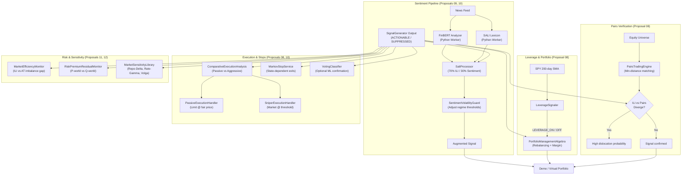

---

## 5. Python Analytics Worker: Service Architecture

Internal service decomposition of the FastAPI analytics worker showing all v5 endpoints.

[![](https://mermaid.ink/img/pako:eNqNVm1v2zYQ_iuEPhQtFkLNsAJrMRRwbMfNYMcvMtIB8z7Q0lnmTJEKSTl2iv73HUnJKZ0Nnr_4QPEePrx77o7fklwVkHwiSalZvSXLwUoS_JlmHRZWyVIzaWqlLRmzI-hVEna4X09r9fTnKvH_5G7WJ0NZ1IpL-9tap5_fbnm5pXarVVNu68YSyyugBjQH826V_PUCtBhmS8Rxf-nv2fT-hGMCkKmYEKRmR6FYYa5IruSGly8YIIuVfMV8iNtUBVbz3JC3--t3EffBLZ6Y5qwxTHB79AfhIvmJjPDGJWi0enf9iOd0nDkn-AE4VSKQvG2QIm4gmWWWG4vfLvDrIQgTR_KGDDTfWKT4S0yxsQpk7k5kYWtagIU8RHd2XCqdb7tdmEYdcfWYzrdwBi34ZtMYrqR3vrOKzLTKwRiS8aoRSFnJC3wXUGICyQSPEuYV2xFDNtne09Xc7NLSLVDtnfyho96i_4U8KHeYCzkJgDFr0UH4b-n2uNa88O79-3s6zpYTFIeBai1ixzkUsecjBLd5wzQmg8yUBWk5E-QrCBH59gWvmAWvh2CmJgQlEJ80wnKaq0ZafSRYEAVcCNW0Rq3zZx_VV5HKygK_n-L0BFgmmCAQlvnjplJwCSQbDUiLc5baTK1VFyfj7Jgu3thwiiIuVEUmsYIXHCompfNcs3xnwVhk4dfoM7QEBtzkGpWGqZbcKs1lSfpKa5Te_1AJ3gklPeaPDS9clvH6dP8h1gocIqVogJ2hJRz88TfZBNVUVczV4vCPiD_Ctp6iOyDNVaX2UEHbdmb9nivdim-bIvJdqsMrX6sOPO_Kf6qxiKhV1KeYLFz6Ltw2c5pyR-M1P3xyNVUrbCjk_cfowrdcdvnqHLCmsaKfQ8rw-81wsYyzjH3plZMA5NsW8RIO9kaoNcl647tLPK2qzTnHX2NZ4pbuPLcbe6Pga30qAqZ3au93YQWWqNALRw44K6XyjRD1MDzUgnHJ1qH0YybX7-l13J6dc0umeMFBYqydCfM5rYWyV6TXv71Cdco96BL7YNwVHk514qPtMfanBkQ3CjXNTNDND40Jif19JvYgoEa3cBZNyXxKYM9Ec4qSa45-Y_gaZ3TLughDFI50A8w2Giiv3KRleA2Pln3pzcgDwsOlWXLLD1CQO5wD2KHPgvtzFNn5U0th41wo9y7pI31SWhR0w7im7kJtK6Ff3TK5UbJARJ6fdaLR7t_ALN5K0FDVQan0BldIr80Bkhr5j3EXbvQeTgJ0uivxoZDiKwB07XIDNHdbPOI9jiAlacahxHin6LzGHp_V4j90GZ4olH52gx_l2E5NtLq5hWZozGiEcnWDOcgQLR-2gOWeKR7KTftueL8Jo8vt9JMIjXasOOC2YaPZNuAzpNAQQ9sMRmhWzje0AWeFAkUryPoMo1Wn2xh05i63a6m0sU2uSFKBrhgv8NH3LbFb7Jvu-VfAhuGUS75__wf0o0O1)](https://mermaid.ink/img/pako:eNqNVm1v2zYQ_iuEPhQtFkLNsAJrMRRwbMfNYMcvMtIB8z7Q0lnmTJEKSTl2iv73HUnJKZ0Nnr_4QPEePrx77o7fklwVkHwiSalZvSXLwUoS_JlmHRZWyVIzaWqlLRmzI-hVEna4X09r9fTnKvH_5G7WJ0NZ1IpL-9tap5_fbnm5pXarVVNu68YSyyugBjQH826V_PUCtBhmS8Rxf-nv2fT-hGMCkKmYEKRmR6FYYa5IruSGly8YIIuVfMV8iNtUBVbz3JC3--t3EffBLZ6Y5qwxTHB79AfhIvmJjPDGJWi0enf9iOd0nDkn-AE4VSKQvG2QIm4gmWWWG4vfLvDrIQgTR_KGDDTfWKT4S0yxsQpk7k5kYWtagIU8RHd2XCqdb7tdmEYdcfWYzrdwBi34ZtMYrqR3vrOKzLTKwRiS8aoRSFnJC3wXUGICyQSPEuYV2xFDNtne09Xc7NLSLVDtnfyho96i_4U8KHeYCzkJgDFr0UH4b-n2uNa88O79-3s6zpYTFIeBai1ixzkUsecjBLd5wzQmg8yUBWk5E-QrCBH59gWvmAWvh2CmJgQlEJ80wnKaq0ZafSRYEAVcCNW0Rq3zZx_VV5HKygK_n-L0BFgmmCAQlvnjplJwCSQbDUiLc5baTK1VFyfj7Jgu3thwiiIuVEUmsYIXHCompfNcs3xnwVhk4dfoM7QEBtzkGpWGqZbcKs1lSfpKa5Te_1AJ3gklPeaPDS9clvH6dP8h1gocIqVogJ2hJRz88TfZBNVUVczV4vCPiD_Ctp6iOyDNVaX2UEHbdmb9nivdim-bIvJdqsMrX6sOPO_Kf6qxiKhV1KeYLFz6Ltw2c5pyR-M1P3xyNVUrbCjk_cfowrdcdvnqHLCmsaKfQ8rw-81wsYyzjH3plZMA5NsW8RIO9kaoNcl647tLPK2qzTnHX2NZ4pbuPLcbe6Pga30qAqZ3au93YQWWqNALRw44K6XyjRD1MDzUgnHJ1qH0YybX7-l13J6dc0umeMFBYqydCfM5rYWyV6TXv71Cdco96BL7YNwVHk514qPtMfanBkQ3CjXNTNDND40Jif19JvYgoEa3cBZNyXxKYM9Ec4qSa45-Y_gaZ3TLughDFI50A8w2Giiv3KRleA2Pln3pzcgDwsOlWXLLD1CQO5wD2KHPgvtzFNn5U0th41wo9y7pI31SWhR0w7im7kJtK6Ff3TK5UbJARJ6fdaLR7t_ALN5K0FDVQan0BldIr80Bkhr5j3EXbvQeTgJ0uivxoZDiKwB07XIDNHdbPOI9jiAlacahxHin6LzGHp_V4j90GZ4olH52gx_l2E5NtLq5hWZozGiEcnWDOcgQLR-2gOWeKR7KTftueL8Jo8vt9JMIjXasOOC2YaPZNuAzpNAQQ9sMRmhWzje0AWeFAkUryPoMo1Wn2xh05i63a6m0sU2uSFKBrhgv8NH3LbFb7Jvu-VfAhuGUS75__wf0o0O1)
[Local Diagram 5](images/diagram_5.png)

```mermaid
graph TD
    subgraph "Transport Layer"
        Arrow["Arrow IPC Endpoint<br/>(high-throughput time-series)"]
        REST["REST/JSON Endpoints<br/>(small payloads, config)"]
    end

    subgraph "Econometrics (v1)"
        ADF["/causality<br/>ADF + Granger + AIC"]
        OLS["/econometrics/ols<br/>Full OLS Statistics"]
    end

    subgraph "Anomaly & Drift (v4)"
        Autoenc["/anomaly/detect<br/>PyTorch Autoencoder"]
        Drift["/drift-diffusion<br/>Ito Process Simulation"]
    end

    subgraph "Regime Models (v4)"
        GarchSvc["/risk/garch-regime<br/>GARCH Volatility Regime"]
        DlSvc["/regime/hybrid<br/>CNN-LSTM Ensemble"]
        QedSvc["/regime/qed<br/>Quartic Potential Well"]
        Climate["/climate/simulate<br/>Multi-country Trade"]
    end

    subgraph "Optimization (v4)"
        SgdOpt["/risk/weight-delta<br/>Online SGD Optimizer"]
        SobolSvc["/sobol/simulate<br/>Quasi-random MC"]
        Riemann["/backtest/riemann-zeta<br/>Discrete Monitoring Correction"]
    end

    subgraph "Risk & Liquidity (v4-v5)"
        GexSvc["/risk/greeks-gex<br/>BSM Gamma + GEX"]
        LiqSvc["/liquidity/comovement<br/>PCA + Amihud"]
        ToxSvc["/liquidity/toxicity<br/>Order-to-Trade Ratio"]
    end

    subgraph "Sentiment (v5: Proposal 09)"
        FinSvc["/sentiment/analyze<br/>FinBERT"]
        SaliSvc["/sentiment/lexicon<br/>TextBlob SALI"]
    end

    subgraph "Stops (v5: Proposal 08)"
        StopSvc["/stops/calibrate<br/>Markov Stop Engine"]
    end

    subgraph "Diagnostics & Explainability (v5: Proposal 10-11)"
        DiagSvc["/diagnostics/stats<br/>QQ-plot, ACF, Convergence"]
        VolSvc["/analytics/volatility-forecast<br/>Volatility Projection"]
        TourSvc["/tournament/evaluate<br/>Model Tournament"]
        ShapSvc["/explainability/feature-importance<br/>SHAP Values"]
    end

    subgraph "Fixed Income (v5: Proposal 12)"
        QwSvc["/fixed-income/q-world-fair-value<br/>Q-World Bond Pricer"]
        GkSvc["/fixed-income/tbill-greeks<br/>T-Bill Analytical Greeks"]
        CurveSvc["/strategies/interpolate-curve<br/>Nelson-Siegel / Cubic Spline"]
    end

    Arrow --> ADF & Autoenc & GarchSvc & SgdOpt & FinSvc & DiagSvc & QwSvc
    REST --> OLS & Drift & DlSvc & QedSvc & Climate & SobolSvc & Riemann
    REST --> GexSvc & LiqSvc & ToxSvc & SaliSvc & StopSvc & VolSvc
    REST --> TourSvc & ShapSvc & GkSvc & CurveSvc
```

---

## 6. ILI Calculation Pipeline (Detailed)

Step-by-step flow of the Institutional Liquidity Index calculation with all guardrails.

[![](https://mermaid.ink/img/pako:eNp9VV1v4jgU_StXPNEO7FB2Zx_QzkiBQIWWAiJMK41GQia-EKvGztoODFv1v8-1EwqdsMsDNuSc-3HuR14aqebY6EHD4j8FqhRjwbaG7b4roE_OjBOpyJlyEPeBWViKHdqUSYz7dcgIXZp5VMwcCz_Q1FFTbXYe5E8mxb_MCa0SNHuRYh09now9OOIsd2KPYykGTKaFZE5fsf2UePATim3mkJdnQsgrhu8LZrhHz43-cYzJttl6AcL_dXikdIjan0weIUaHqY-8Dk3E1iPpUEzeo0JzPdhIonHBpr88MMW2Xq8SGPfbX74EDXsw0YwDGcGVVSy3mXYWmslstGjBcOS_F4t5C8azRf-mJAce8b3EPRjw3YLIScUF6wz6CpdYj3mDLqNV8hDBh3BZxvHwEXI0kOpdrhUqd40i0CAHqfXzmqXP0Ox-6vKPf3b4x26H35y8MEmlVLbYbCh7MgScWgSaf8FdB3ItlLNV6G_2yQEp2IMpm1I8cUQRjafJ19FoPBgPp8sSjdIifEOjYc-MYFQ-b7PzW6fTubtikJqpNPhLQsHMIzUj_4VTUb6tjMlbdNicpOP-ttey4ip-SpKwxHhKenCPDnCz8R2yRziEPqSarRn5-QA0P2Lt68mrGJ-St-heDnc9SuCPFhy6p8vv_tJ9vdQyUsdzEiCsz-ocexlIsLdALqjgYl24UyCQG51r45uXSXm8Skscc4WFzxAP7xdRPIxXg9nDfDYl5akxosnwQrhISpL_nXgXlvwAf4bD3W0QkbI_dG9PQkKbkrv9PzHDNJZGyEXh1Vu2-4I85n5sv5_HD-bMUDooYZBh-mzPwQQbZ1uf2px58YxBGXYPpJ5Qaat4nehnvgdR4TQtCNqXhmDlFrhg-o8Hts-eXoRdVcgW7Cy-1pL0pTyvnmqpYC2E0yzE42QyG0TLYUxD7At0BtJzH6nfJFS9Iid9rSX7lVBtipr8cLBhK9mL8oX9B7O__8vpYzQZv_d3kUDpNuDmaFJqRiGxbZh6Bk1pgV8GcBCK60ONEOU5SWhwS--UNqsWPLiMIs-05LZGGAnp_DbKmFDQ9BunzbIwj6kmgj4of7Pu5n10lShRWNdsLbESAZragK2k8n1ALWm1qmYysIgd90NqlqYInK6oK6m31IpCilVGD7Q5NlrQ2CG90QSn1-lLw2W4Cy9WjhtWSNd4ff0JeBBh_Q==)](https://mermaid.ink/img/pako:eNp9VV1v4jgU_StXPNEO7FB2Zx_QzkiBQIWWAiJMK41GQia-EKvGztoODFv1v8-1EwqdsMsDNuSc-3HuR14aqebY6EHD4j8FqhRjwbaG7b4roE_OjBOpyJlyEPeBWViKHdqUSYz7dcgIXZp5VMwcCz_Q1FFTbXYe5E8mxb_MCa0SNHuRYh09now9OOIsd2KPYykGTKaFZE5fsf2UePATim3mkJdnQsgrhu8LZrhHz43-cYzJttl6AcL_dXikdIjan0weIUaHqY-8Dk3E1iPpUEzeo0JzPdhIonHBpr88MMW2Xq8SGPfbX74EDXsw0YwDGcGVVSy3mXYWmslstGjBcOS_F4t5C8azRf-mJAce8b3EPRjw3YLIScUF6wz6CpdYj3mDLqNV8hDBh3BZxvHwEXI0kOpdrhUqd40i0CAHqfXzmqXP0Ox-6vKPf3b4x26H35y8MEmlVLbYbCh7MgScWgSaf8FdB3ItlLNV6G_2yQEp2IMpm1I8cUQRjafJ19FoPBgPp8sSjdIifEOjYc-MYFQ-b7PzW6fTubtikJqpNPhLQsHMIzUj_4VTUb6tjMlbdNicpOP-ttey4ip-SpKwxHhKenCPDnCz8R2yRziEPqSarRn5-QA0P2Lt68mrGJ-St-heDnc9SuCPFhy6p8vv_tJ9vdQyUsdzEiCsz-ocexlIsLdALqjgYl24UyCQG51r45uXSXm8Skscc4WFzxAP7xdRPIxXg9nDfDYl5akxosnwQrhISpL_nXgXlvwAf4bD3W0QkbI_dG9PQkKbkrv9PzHDNJZGyEXh1Vu2-4I85n5sv5_HD-bMUDooYZBh-mzPwQQbZ1uf2px58YxBGXYPpJ5Qaat4nehnvgdR4TQtCNqXhmDlFrhg-o8Hts-eXoRdVcgW7Cy-1pL0pTyvnmqpYC2E0yzE42QyG0TLYUxD7At0BtJzH6nfJFS9Iid9rSX7lVBtipr8cLBhK9mL8oX9B7O__8vpYzQZv_d3kUDpNuDmaFJqRiGxbZh6Bk1pgV8GcBCK60ONEOU5SWhwS--UNqsWPLiMIs-05LZGGAnp_DbKmFDQ9BunzbIwj6kmgj4of7Pu5n10lShRWNdsLbESAZragK2k8n1ALWm1qmYysIgd90NqlqYInK6oK6m31IpCilVGD7Q5NlrQ2CG90QSn1-lLw2W4Cy9WjhtWSNd4ff0JeBBh_Q==)
[Local Diagram 6](images/diagram_6.png)

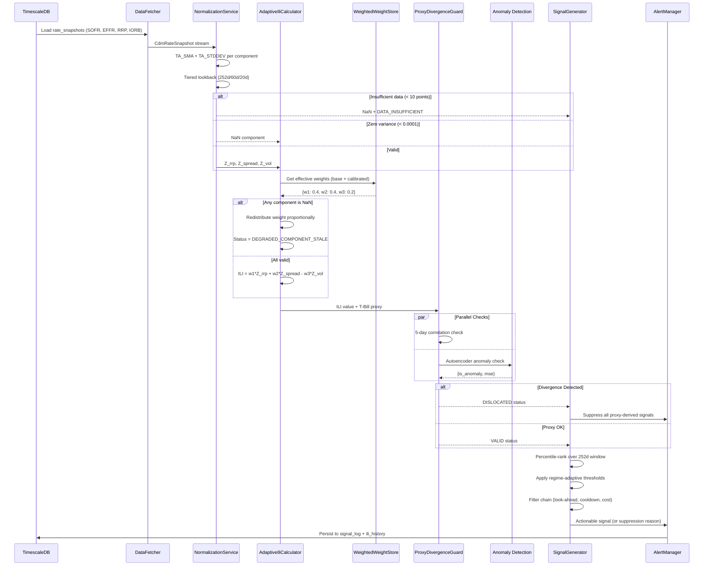

---

## 7. Backtesting Framework Flow

Data flow through the backtesting engine including walk-forward validation and multi-model tournament.

[![](https://mermaid.ink/img/pako:eNqFVmFv2kgQ_Ssjf6gSFV-AXO_U0ykS4KSJjhyoRvSkuDot9gCr2F7f7joJbfrfb2YXA6ZC4YuX2Zk3O2_njf09SFWGwR8QrLSo1jCLkhLoZ-qFNyRBJKyAqcZKaGGlKpPAu_AvGj6cJcFMFmhSkWM0TILzrxCGV_AZq1xsHpLgVhqrtKRtBvJm1H8u9MXV2WdhEUwpKtOBye14NO_A3fiuA5VWLxvAJyytOU-Cr_uEPt5lGORyVT747OGwTh_ReltBYR7f0ta_C7_1HjLOpkW5wj0mlllS_lTyUKSPFo2F63IlSzys2GVw-f3ew97bG3zmSGzCxSbM6KzaHbldhnd1MFNZYe6BYoIW-c7ikYgQSOp-72Ofil9RQc0_793GbUI9stJ2qXKpHHRR51R_trd6-EoZybdKNzB9N-6A1SJD8xZB1y-Y1hxGZxK5NAWcPX04P-Rpl8YdJULfDO4Z-Wi1bQJnC3uQ4VLUuW0X5DYdRJzLqhIr5mmu8rrAmDsua8wOK6m7l4vfiKBuN_sdzvhvegkXMIii-Xljfp0q89pK0mC4PCNlLHcVNYoRqauRTXBPOsn9iU3j_x5SVRTSGPJ6i7JJRd0ov_0kIQfuFWOofHPQUN7ic8ZroSvsQKTFc6aeyw58kcQ-XWkHRqyTC_bAY7U4SAf_BeVqbekUlGC35hM1YhySLo0UJfF1IzUu86Oe3QU5uMkkZiCRP94o_Sx0Nqc-IIU1tzoo07XS1G_k2MYhAyPQFdwVJPQnZL3CFXR_6SXBKwwqNoqc0O9FWZMeGgt8ompPQP2tQO7RGOcvxIow-AGjWmtO4kswLYwduiMp3rGDmX_GVBK-cbfb2rlX3sFM1boUrqhjURzex0grY-auTrd0_XVEImv_ycA_n4aKu4SW43h236azwXGgLjey0hzcwVm2A9dNkNDgim2YtaG20V5ua8H0xbeDKVy_0ASTpVjIXNqNR7pBYWuNzDopXZTpUetxfPMiIAdW1J4Xb_NAU9Sh9oONxEQvGWneFlNsNRoDMxKJLFfE868tng_Gq_ek9GP5Xy0zOv_WBHGKJWVT7XbYbrrQHhPwTPKGG5oGKfS7vQ8nnfvkzHVBXMlHZN-PJ30v-dIn87uIgBG_sXe_e8p7KLSWqN1ccCu4lZbLDvnNt52hWi5tGMnlsm7PoiOsUS4LEhGn96vTZBDxQQeCAnUhZEZfCN8DuyZ18bfCdlQHP378DzntoNo=)](https://mermaid.ink/img/pako:eNqFVmFv2kgQ_Ssjf6gSFV-AXO_U0ykS4KSJjhyoRvSkuDot9gCr2F7f7joJbfrfb2YXA6ZC4YuX2Zk3O2_njf09SFWGwR8QrLSo1jCLkhLoZ-qFNyRBJKyAqcZKaGGlKpPAu_AvGj6cJcFMFmhSkWM0TILzrxCGV_AZq1xsHpLgVhqrtKRtBvJm1H8u9MXV2WdhEUwpKtOBye14NO_A3fiuA5VWLxvAJyytOU-Cr_uEPt5lGORyVT747OGwTh_ReltBYR7f0ta_C7_1HjLOpkW5wj0mlllS_lTyUKSPFo2F63IlSzys2GVw-f3ew97bG3zmSGzCxSbM6KzaHbldhnd1MFNZYe6BYoIW-c7ikYgQSOp-72Ofil9RQc0_793GbUI9stJ2qXKpHHRR51R_trd6-EoZybdKNzB9N-6A1SJD8xZB1y-Y1hxGZxK5NAWcPX04P-Rpl8YdJULfDO4Z-Wi1bQJnC3uQ4VLUuW0X5DYdRJzLqhIr5mmu8rrAmDsua8wOK6m7l4vfiKBuN_sdzvhvegkXMIii-Xljfp0q89pK0mC4PCNlLHcVNYoRqauRTXBPOsn9iU3j_x5SVRTSGPJ6i7JJRd0ov_0kIQfuFWOofHPQUN7ic8ZroSvsQKTFc6aeyw58kcQ-XWkHRqyTC_bAY7U4SAf_BeVqbekUlGC35hM1YhySLo0UJfF1IzUu86Oe3QU5uMkkZiCRP94o_Sx0Nqc-IIU1tzoo07XS1G_k2MYhAyPQFdwVJPQnZL3CFXR_6SXBKwwqNoqc0O9FWZMeGgt8ompPQP2tQO7RGOcvxIow-AGjWmtO4kswLYwduiMp3rGDmX_GVBK-cbfb2rlX3sFM1boUrqhjURzex0grY-auTrd0_XVEImv_ycA_n4aKu4SW43h236azwXGgLjey0hzcwVm2A9dNkNDgim2YtaG20V5ua8H0xbeDKVy_0ASTpVjIXNqNR7pBYWuNzDopXZTpUetxfPMiIAdW1J4Xb_NAU9Sh9oONxEQvGWneFlNsNRoDMxKJLFfE868tng_Gq_ek9GP5Xy0zOv_WBHGKJWVT7XbYbrrQHhPwTPKGG5oGKfS7vQ8nnfvkzHVBXMlHZN-PJ30v-dIn87uIgBG_sXe_e8p7KLSWqN1ccCu4lZbLDvnNt52hWi5tGMnlsm7PoiOsUS4LEhGn96vTZBDxQQeCAnUhZEZfCN8DuyZ18bfCdlQHP378DzntoNo=)
[Local Diagram 7](images/diagram_7.png)

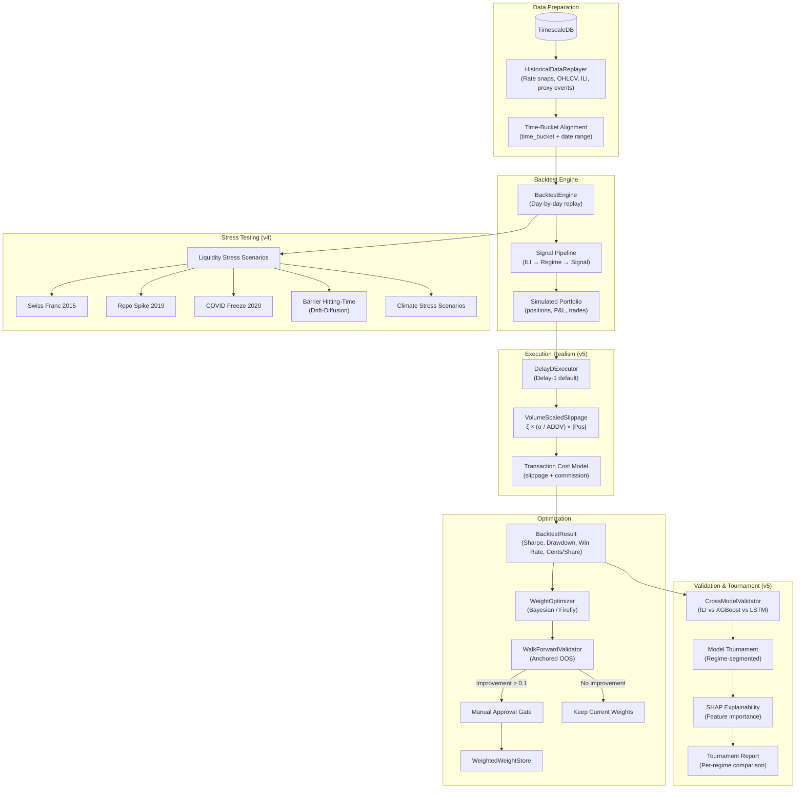

---

## 8. Demo / Virtual Portfolio Flow

End-to-end signal-to-virtual-trade pipeline with dual portfolio comparison.

[](https://mermaid.ink/img/pako:eNqFVW1r2zAQ_iuHP4yUxfR7GIGsTdtA1nhxGQwKQ7GujqgseZKcNiv97ztJdmIvKfMXJ7rnnnt57uS3pNAckwkkFn83qAq8Fqw0rHpUQE_NjBOFqJlykIsSmPUvxeQtKjTMaXOKu9U7j8u6Iye0ojM0ihH9KT5jNZroQT8eDONClXNVCnUGvMRATi8KX2JMBs9k8Y2Z55hI_JU7XedoduJcCvNXLDzUvxufL9wxxc_yZto4D_0hjGuY9H-ftBT6FLnGusXGLL8TXLh9PH5U0YFM6XRK7ZnAmr2ADchoosPONOOVsFZshCeAYovFM4wWywVYx1xjx2CwFBWOoTb6dX_RkTPp2tiwUKzlkG39XQiKEVOawFKXYJu6NkhAaoJBZnXLhdJiRzb7gGo6DRJSvlcPi9X97OtyfqjoiAwYwpKGE7gKtchWzlBPj7STOT1SL-c_5uvZ7fzX6h4ue_9ubvoxfOVDG_SeLoMsVL1G3hQItbYiSG_FH4TRQ0rdlmC0CwN8cWQIneilcZ7bjxJx68YhOA14mKxtf7ICn-L91L3jwT9HiYWDinYURhmjpu-Qys6VoCgXJ06xoDjFCLs4ouBopXCgAMEIHRfDN6AU1tEOHlrwpA1JoWsKrAQtOS1k319qMmUdeFWjGvYgEvci5F7WlCMhOdJqBG7cMdmE5g69w9R6gDOiLNEgH9oHEWLFV1Lbo4JDeJBrVXujKgcL1n_iHrYz9l_0cIBi9M_UR5pWi_-EV_xDqVsduvXzVx_S0hXacBhRn8x-TIMj3BiyT8tW7R7FvSaR_cUKHcM1E3IPrHG6ooZz4grnXzbmcnonHNCNTZfEDZOHbtE4hcMAucbSp8BhZ4HEERw2dAU8c_2iIiDz1wtw8jKl_1aAqGpWuGiMl0O6YTYybJp9SrOebrXkkGc_kzEkFZqKCU7fm7fEbbEKXx6OT6yRLnl__wuMLB6Y)
[Local Diagram 8](images/diagram_8.png)

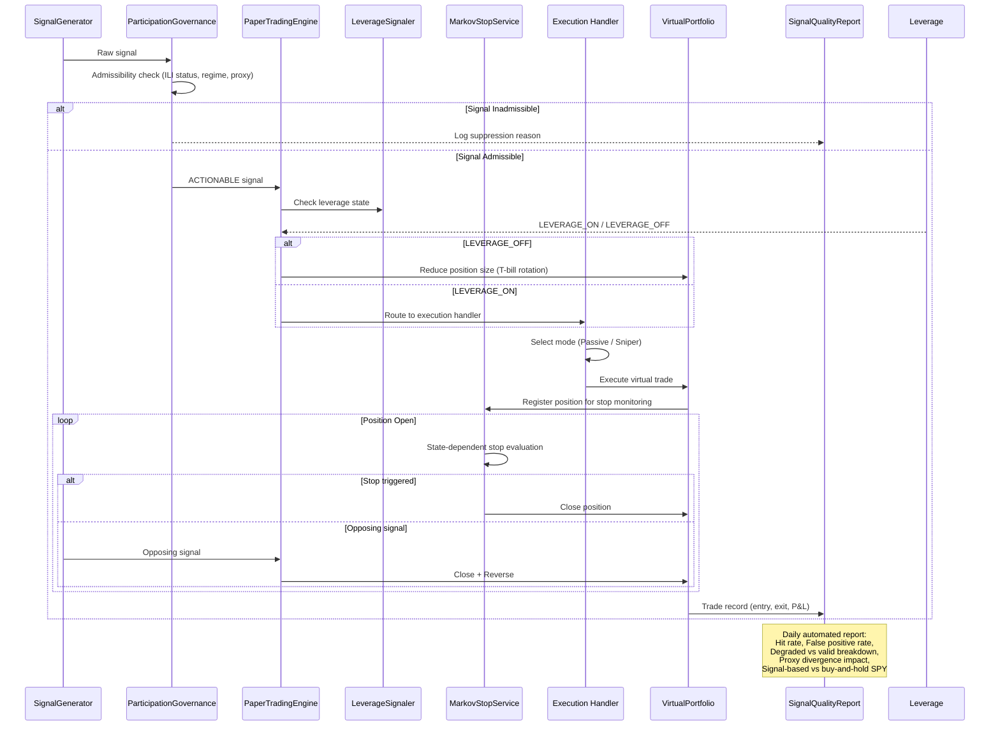

---

## 9. QED Potential Well & State Dynamics (Proposal 03)

State-transition dynamics of the QED (Quantum Economics Dynamics) model.

[](https://mermaid.ink/img/pako:eNqFU9tum0AQ_ZURT3Zbt1XUviAlEsHUlXKxZXAaKW6qMYxhlfUuml07OJb_vRsIwk5SlSeYOWfOXA47L9UZeT54xqKlocCccTXYnMwVuOfuw28YDM4gToLzy6iJNe91-CpKgubThxBLYVHCD6kfYcK62sJQbIhzUik1zA5-UNSHIYulhVAzU2qFVu-CZ9ct_ByZBTGErI0RKodeyGiKZ80FnMHXz9_7TYWW8qbVK-QHshBbXAgpnrATPaJEt-NRdD2exX_in-PwwjUqDBrrpANJbKE3i0fxl9EwCOP-m9X8hzx_Eay3_hoMuyZ5dIF1WTIZ02XaSJ0OHlFYH5LkEqKqFLwFzW5OtXYXCSUhN7x9q_ta8fAeUzJabij7N7I7Rlzo9AEik6J0g5i2vNJuKhZ5YUEvD3bfdT9xCGWFa-8XSel3iZte1YdTwOr-G3yERXV_0uVajy2fPVY6jwkyB9TpdOLMhELBDUmdCrt1FZJRAGGBKn8xIamsbs_7BN6KeIUic_bfebagVf0jZLTEtbTefv8XrkvsNQ==)
[Local Diagram 9](images/diagram_9.png)

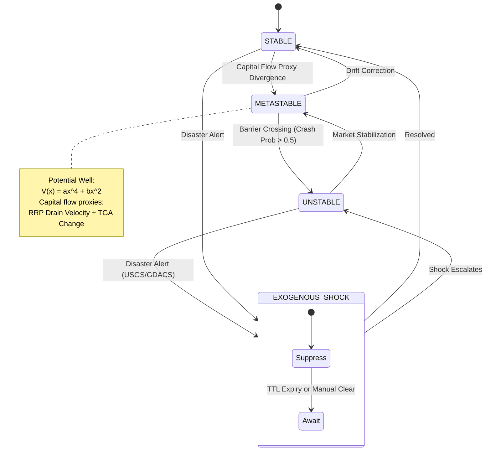

---

## 10. AUMF Uncertainty Management Lifecycle (Proposal 06)

Five-stage uncertainty management framework controlling signal admissibility during crisis periods.

[](https://mermaid.ink/img/pako:eNptlFtv2jAUgP_KUZ5WjWotF01CU6sshAmNmwh0q8pUmfg0WE3szHZKr_99J04IvYwHFDv25-9c4icvVhy9PniJZvkWloO1BPpNlBRW6au1N2H6Fi0ESnJhhZIQWY0s-7bRX84-jcYj-AwXKmVWpMI-0OBH-Jv-_SWMpEVpaPJo7f2B4-MzCGUiJBLTX02GEMUomRaqnqZFa1kdXk24LXOtbkSKT6WHjbdoINDCCLN_cV55BLOL0aAF0U4YA0PNZNyCBeYKolzcIgm8VOR6V4l-XnuXaNbeM0QdUoosSxA6fYhW0TycDsLB9WoahIulP5ouL53cR8BUlfsH4g51UjqGKd4xixxWMkZtmZD2oTb0s41IijJFGyY54H2MyJEf1GrKO7V2o9buw3wxC0ISC_zVcjRbReOD19vdlVd02mw-7cN0tpj441dZjjouwz9FmlLeKLkUQDk4rkZO24-tcBGdN56H9e9Uu81pXcqiPwyvJ7NBWEW_3GplLeVtp4VF3QJjVQ5cmLys6lETxgd4HUmnke466ajXHNbrw4TJgqUwoxQYkWxtnfEdExZUjppRJ4Mf_DycE_UqTHvPNcWm-gAIKxJJNJ9n1ExiU_U1dZ8W92uvWu0Qp7XisEjTJpSqH6rnstEDKtTU_z4OwTisaRQco10zFsiLmPrGiEchExeyeEROhLky1WdHrxDWxckJ_wrFob2ub1hM4b3FdmqsT2amyHONxiB32GZ0VSYXWGFV5lr2v37dGhQ9GIsZ5KyoOXP3RIxfrqBg6wLz1h7kSpyXq18De3uzsjgUKmyLjMmS6GbcfeOKqfFO4A7-Flhgg0DJvRZ4GeqMCU631pNnt5i5-4vjDStS6728_ANR4Iyp)
[Local Diagram 10](images/diagram_10.png)

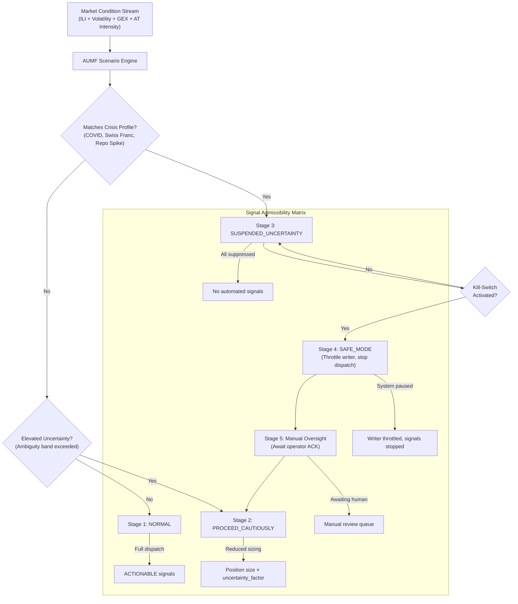

---

## 11. Stochastic Weight Optimization & Calibration Loop

Closed-loop optimization cycle with Bayesian/Firefly meta-heuristics and OOS validation.

[](https://mermaid.ink/img/pako:eNp1VGFP2zAQ_SunfGrFymDSJhRpSJQCQoPCaDekadJ0ja_JCcfObLcdQ_z3ndO0adfiL3GSd-_O7975JcmsoiSFxNPvGZmMBoy5w_KnAVkVusAZV2gCDPqAHsZcks9Q06C_C-mPI6SP2VMgHy5MzoZ2UXdV4JL_kluCn8kzmveX7Giqn9u_u4EjO7E6Bi03Iy5nGgNbsyfH3SgCH1E_XVq3QKe-o2aFwe7hfWAq0ZgYsNr-oIBwbp2jbH-CKwwUA27RzFDDWVU5O5dN_L6ncslbwx-J8yKQWj7rz7vo65vriD1TKFrM6VrzOeosnjVWv8Rrayu4tSYUopn85omrpYDz50w3nHEN-r3T0_44hRuLCgr2wsHSPxAtEDrHJ0cqcj1NpGndNqw_lrB1K1K45GDIe9BolLS_IuiMCnTyrKSPi_o04Cl0V_U1Z4J7dKg1abj4U2nrNtq1Wuss2xlXxoCre_Az52weFS_FrbqNl2reJqtdksLXGXruOYHaMpaEJQWp2WNZaTZ5G0-RrH3dpGpskcY-i96KfeaoLsdwFNTkkK3NAp2JuOfz0eHHkw-fNjRtSHrb52xMRgpC4cgXViuQ4eFSjuvfqkfsncK9s5X1EtjKD4-_bBU2Yu5GK_SZyQpxm6BlJnrT5VBAZ8GiywKGECzEoYXhwXF3m6AxUByppucH8EC5CAAipbhps0rU4t8yDgOVJF4-haPD41VcRzi62w2rjRaHJl3WDgsOBdCcVbyMtrERFvsapyZtJk-6gfXs_YetQS34W6WifbJmUNai-f1RMoEpDGkBNJ3Gps5pF0_aEwytaIBGDDCdaeD24Nu8QyvJ5Y-DqOQXogoy8XQUaJd35el6k7yDpCRXIiu5pV-SUAh9vK8VTXGmQ_L6-g_HJeID)
[Local Diagram 11](images/diagram_11.png)

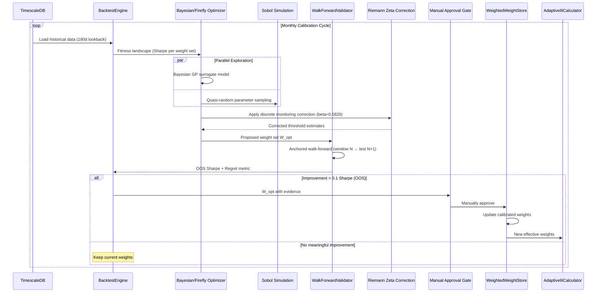

---

## 12. Deployment & Container Architecture

Docker Compose topology showing all services, volumes, and inter-container communication.

[](https://mermaid.ink/img/pako:eNqNVGFP2zAQ_SunfEq1AS2FDiFAapuyFUGb0VCEyD64iZt6S-zMcToq4L_vHKesSctEvuTkPL97d-8uz1YgQmqdghVJki7Ac3wO-GT5zBz4liOCX1RCXySpyCgM-JJJwRPKlW8ZcO1CN01jFhDFBIcJlUsW0GwTqp8eQVIePvpWGYF9RZYEDo8bZzN5cDFJJeMR3Ez78AmmTKqcxOAtJCVhVgBcIdUpnDRPmr71o8p9LyQKRuouJ_FKsSArj8B2V2qBqtr7rUOT55JkqusOMckd6hSSV8ibrS1yh2SLmSBSS3-LwR7RJ7X_M4NWqX8UMf60wdVuNreFXhMeYpXIVEbgkoh-iKwqDPvn851eOEQRGPK5xDplHqhc0roV3sTpPdq-5bGEZgGJqdMzub62OtiXt2MYPCnKM3R1Q8rxUfvQtxq1wsZLKuex-KNp-wucFhbg_e85zWlxd_0dpiLOE3Nmj6Y3FA5AJek8a1Q5369vPMtwwsiMxUytwF4eNerlXREaFdNggg3trU7npAP23bCxcXjUbn0Be-xduxDduv3GB_s8TvW444xOWEgDIusqxinlvd6jBuoA3JiouZBJddyaphOD37muBlcANwcEj1c7ZNT0rNdob-_iBWt1en3feim8rX4_Oz_XgK6U2P6h2zcZJ3rHVUNfMauyi7TmpAavjTTwf_tgLtwOJh5O0P1EQ0uuXcS62xpiHDKIcmPfB1QpilQ2LRpXlGH6vO7OhlN6iiU6tenQ5e3AQW_0C_BvUGn26OGS6mUfPQAGW59dEa8iwRFQRvtMvAHe9eeb57lFV3TK_wKK9LsQ93RmXMMO6-o1uJTgc-szWAmVCWEh_tufLbWgSfGXD-mc5LGyXl__AowFzZY=)
[Local Diagram 12](images/diagram_12.png)

```mermaid
graph TD
    subgraph "Docker Compose Environment"
        subgraph "Application Services"
            Backend["Backend (Java 25)<br/>Spring MVC + Virtual Threads<br/>Port: 8080"]
            Worker["Analytics Worker (Python 3.12)<br/>FastAPI + Uvicorn<br/>Port: 8001"]
            Dashboard["Dashboard (Next.js 15)<br/>Nginx<br/>Port: 3000"]
            Landing["Landing Page (Next.js 15)<br/>Nginx<br/>Port: 3001"]
        end

        subgraph "Data Infrastructure"
            TSDB[("TimescaleDB<br/>PG16 + Timescale Extension<br/>Port: 5432")]
            Overflow[("Chronicle Queue<br/>Overflow Volume<br/>(NVMe / tmpfs)")]
        end

        subgraph "Observability (v4)"
            Jaeger["Jaeger<br/>Port: 16686 (UI)<br/>Port: 4317 (OTLP gRPC)"]
        end

        subgraph "Optional Sidecar"
            OpenBB["OpenBB Platform<br/>Port: 8000<br/>(Equity prices only)"]
        end
    end

    Backend -->|"JDBC"| TSDB
    Backend <==>|Arrow IPC<br/>(Socket)"| Worker
    Backend -->|"Chronicle Queue"| Overflow
    Dashboard -->|"REST + WS"| Backend
    Backend -->|"OTLP"| Jaeger
    Worker -->|"OTLP"| Jaeger
    Backend -->|"REST (equity)"| OpenBB

    subgraph "External"
        FRED["FRED API"]
        NYFed["NY Fed API"]
        Polygon["Polygon.io"]
    end

    Backend -->|"HTTPS"| FRED
    Backend -->|"HTTPS"| NYFed
    Backend -->|"WebSocket + REST"| Polygon
```

---

## 13. Dashboard Component Architecture

Frontend component hierarchy showing data sources and WebSocket connections.

[![](https://mermaid.ink/img/pako:eNqFVtuO2zYQ_ZWBHhZJa8NIgLwURQCvbzFqb3xrmmLdh7E0KxMrkQpJedcI8u8ZkpJsKYuuHwxyOHM4l8MZfY9ilVD0B0SpxuIIu_FeAv9MeQiCfTRGi7DAM-l9FA7d75_tu_t9NHgyAyNSiZn586AHH99sCLO-FTlBJX67j_67tnpfWRVaxFQZLcSJwAugLBK01LEaruZstZlsd27pbQZYiMHp3eC3RpFkspe_OD9SmmB0RG3Ntfcrd9l84WCXZWZFf4Wy0vPw_hx-B1bh_60PBZaoH0k3PqdH-0Tuv8Jv-8wX6yVaLZ7vvReaMrRCSQjCALJiuIJi6-L_RGhzLNoo4eaFShmk8oI3MNMi-RXBF8odvX0lKS6qG_hrNYcR6qSVGD5ysvug5JbhnhNmJfXAWLSl6UEIvBPyVJM5SjLmviJNIwCX3iwgTTeTcQ_u_oUpJT0uhHo-t2HYLxcEgzgPx2iOB9X4sdjOe3BLFnuw2azgC2UqFvbcg9nk62thb4R55Lg3lDp-epdasYcDL3d0C2pzmYgYrdLh_tlwM_oEAxjd3fUX292Sl-vJuEPXv5fTGsWtYeuzFgA-9DmHKRNdxqQtCmk74W9LzU_BNH7U-64nE2m1Ks79AxpKAKXKMTu_loLTh0tCYfJsSRrmZCsLW5K24qK7nXecBmlrflZFFPJ2stm5tzFczNsBTJ4prp1369LTfqTyAjkOJSviojGOtCcDwzRlorhdG2iFQpsayW-43lo8uCyIGmfMZjolzibkSgpOTxtkQacagpekXe5DaYP95zsu4efpFESd3k45rCoaJ8ZnibmIgzDYu6agTv5hEFiNMbeINsJ6XZvvUGTgWbhe91eZsnUIhlvCIeQpEZhKZayIu01w1JDqi3K9JGPeO-mlETCOT0Ts-lG3HckmD1vMi4xgmNC3EuNzsHcK_5vIycNDDeAboXUSEQu2OMOsJobrGq6kOxD5ATNkuDbM8pLNpZL8kPUZVioTlR9bx0juZhxby2ynSn2xSyjzEq4GU7N183IBcUO19tUzTfTY3B52cHVhPcEK1R9T5lsMF7U_wzznNSc9xdfe1y3Xn8eX5TYzplxdv6vb3eRbybfcX2kFCYxKfaKWq7e7scanRD1Jx7pqGeZMR4-nwo7JnAlJlxlRSzq64Q2Sf02aU2dJX73LlrLzfqW0ddfzEtz6gcukKrbdLHqO7Qm5YSAkaM7US6PLZdOjVJ6tS_S8DfKXsskfFtDvf2xGNKeymYJufWlPTS_3JeVd03hrpPddpDqsoMAfE16hGnp8fplYN_Uc4tVllrftmk7HOpdmxZu66Th_m_7Rtq26gvO6etj-ItkY1u-Nl8sXEZonwRpX1G4r1axjnQun_OaKOH5fkaNtfl3EqAdRTjpHkfD34vfIHin3X44JPSB_REU_fvwETsVE0A==)](https://mermaid.ink/img/pako:eNqFVtuO2zYQ_ZWBHhZJa8NIgLwURQCvbzFqb3xrmmLdh7E0KxMrkQpJedcI8u8ZkpJsKYuuHwxyOHM4l8MZfY9ilVD0B0SpxuIIu_FeAv9MeQiCfTRGi7DAM-l9FA7d75_tu_t9NHgyAyNSiZn586AHH99sCLO-FTlBJX67j_67tnpfWRVaxFQZLcSJwAugLBK01LEaruZstZlsd27pbQZYiMHp3eC3RpFkspe_OD9SmmB0RG3Ntfcrd9l84WCXZWZFf4Wy0vPw_hx-B1bh_60PBZaoH0k3PqdH-0Tuv8Jv-8wX6yVaLZ7vvReaMrRCSQjCALJiuIJi6-L_RGhzLNoo4eaFShmk8oI3MNMi-RXBF8odvX0lKS6qG_hrNYcR6qSVGD5ysvug5JbhnhNmJfXAWLSl6UEIvBPyVJM5SjLmviJNIwCX3iwgTTeTcQ_u_oUpJT0uhHo-t2HYLxcEgzgPx2iOB9X4sdjOe3BLFnuw2azgC2UqFvbcg9nk62thb4R55Lg3lDp-epdasYcDL3d0C2pzmYgYrdLh_tlwM_oEAxjd3fUX292Sl-vJuEPXv5fTGsWtYeuzFgA-9DmHKRNdxqQtCmk74W9LzU_BNH7U-64nE2m1Ks79AxpKAKXKMTu_loLTh0tCYfJsSRrmZCsLW5K24qK7nXecBmlrflZFFPJ2stm5tzFczNsBTJ4prp1369LTfqTyAjkOJSviojGOtCcDwzRlorhdG2iFQpsayW-43lo8uCyIGmfMZjolzibkSgpOTxtkQacagpekXe5DaYP95zsu4efpFESd3k45rCoaJ8ZnibmIgzDYu6agTv5hEFiNMbeINsJ6XZvvUGTgWbhe91eZsnUIhlvCIeQpEZhKZayIu01w1JDqi3K9JGPeO-mlETCOT0Ts-lG3HckmD1vMi4xgmNC3EuNzsHcK_5vIycNDDeAboXUSEQu2OMOsJobrGq6kOxD5ATNkuDbM8pLNpZL8kPUZVioTlR9bx0juZhxby2ynSn2xSyjzEq4GU7N183IBcUO19tUzTfTY3B52cHVhPcEK1R9T5lsMF7U_wzznNSc9xdfe1y3Xn8eX5TYzplxdv6vb3eRbybfcX2kFCYxKfaKWq7e7scanRD1Jx7pqGeZMR4-nwo7JnAlJlxlRSzq64Q2Sf02aU2dJX73LlrLzfqW0ddfzEtz6gcukKrbdLHqO7Qm5YSAkaM7US6PLZdOjVJ6tS_S8DfKXsskfFtDvf2xGNKeymYJufWlPTS_3JeVd03hrpPddpDqsoMAfE16hGnp8fplYN_Uc4tVllrftmk7HOpdmxZu66Th_m_7Rtq26gvO6etj-ItkY1u-Nl8sXEZonwRpX1G4r1axjnQun_OaKOH5fkaNtfl3EqAdRTjpHkfD34vfIHin3X44JPSB_REU_fvwETsVE0A==)
[Local Diagram 13](images/diagram_13.png)

```mermaid
graph TD
    subgraph "Data Layer"
        WS1["/ws/signals<br/>(Real-time signals)"]
        WS2["/ws/prices<br/>(Live price updates)"]
        API["REST API<br/>/api/v1/*"]
    end

    subgraph "Core Charts"
        PriceILI["Multi-Pane Chart<br/>Price + ILI + Signal Markers<br/>(Lightweight Charts)"]
        CorrMatrix["Correlation Matrix<br/>(Perspective Heatmap)"]
        SignalLog["Signal Log Grid<br/>(Perspective Data Grid)"]
    end

    subgraph "ILI & KPI Cards"
        ILICard["ILI Card<br/>(value, status, weights)"]
        Freshness["Data Freshness Panel<br/>(FRED, NY Fed, Proxy)"]
        KPIGrid["KPI Dashboard<br/>(LSI, Beta, RRP Velocity, GEX)"]
    end

    subgraph "Risk & Regime Panels"
        RegimePanel["Regime Indicator<br/>(GARCH / CNN-LSTM / QED)"]
        AUMFPanel["AUMF Status<br/>(5-stage uncertainty)"]
        SurprisePanel["Surprise Indicator<br/>(Entropy-based anomaly)"]
    end

    subgraph "v5 Dashboard Extensions"
        SentHeatmap["Sentiment Heatmap<br/>(FinBERT + SALI)"]
        ExecPanel["Execution Comparison<br/>(Passive vs Aggressive)"]
        PairsPanel["Pairs Verification<br/>(Divergence monitor)"]
        LevPanel["Leverage Regime<br/>(ON / OFF indicator)"]
        StopsPanel["Dynamic Stops<br/>(Markov state tracker)"]
        QQPanel["Tail Risk QQ-Plot<br/>(Distribution diagnostics)"]
        ACFPanel["Volatility ACF<br/>(Persistence chart)"]
        ConvPanel["Sample Adequacy<br/>(Convergence monitor)"]
        EffPanel["Market Efficiency Gap<br/>(ILI vs AT imbalance)"]
        MpsPanel["Monetary Policy<br/>Sensitivity"]
        TourPanel["Model Tournament<br/>(ILI vs ML comparison)"]
        GreeksPanel["Greeks Sensitivity<br/>(Repo-Delta, Rate-Gamma, Volga)"]
    end

    subgraph "Backtest & Demo"
        BTEquity["Backtest Equity Curve"]
        BTDrawdown["Drawdown Chart"]
        BTSigTimeline["Signal Timeline"]
        BTCompare["Parameter Comparison"]
        DemoPort["Demo Portfolio<br/>(P&L, trades, win rate)"]
        SignalReport["Signal Quality Report"]
    end

    WS1 --> PriceILI & SignalLog & SentHeatmap & RegimePanel & AUMFPanel
    WS2 --> PriceILI & DemoPort
    API --> ILICard & Freshness & KPIGrid & CorrMatrix
    API --> ExecPanel & PairsPanel & LevPanel & StopsPanel
    API --> QQPanel & ACFPanel & ConvPanel & EffPanel & MpsPanel
    API --> TourPanel & GreeksPanel
    API --> BTEquity & BTDrawdown & BTSigTimeline & BTCompare
    API --> SignalReport
```
