# Tickonomics v6: Comprehensive Architectural Diagrams

This document contains all data flow, sequence, state, and deployment diagrams for the tickonomics v6 architecture.
Diagrams are written in Mermaid syntax and rendered via mermaid.ink.

---

## 1. System Topology & Data Flow (High-Level)

End-to-end view of all data sources, processing layers, and consumer applications.

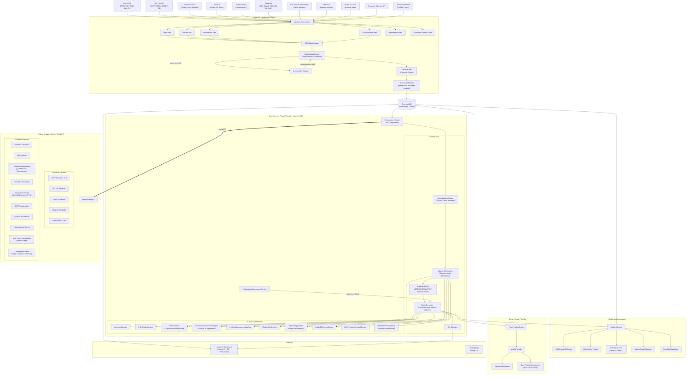

---

## 2. Ingestion & Resilience Sequence Diagram

Detailed sequence showing CDM transformation, quality checks, resilience patterns, and persistence.

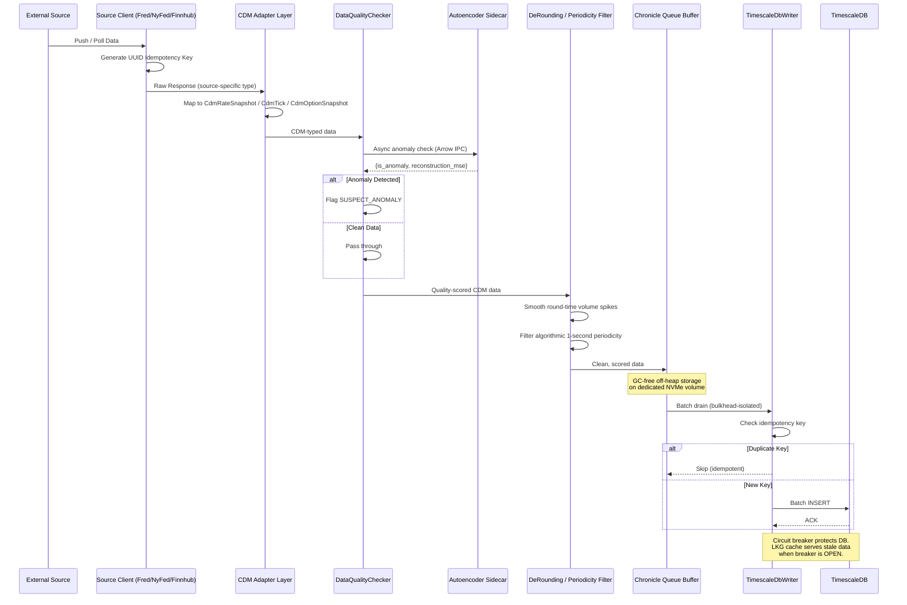

---

## 3. Computation Engine: Core Analytic Pipeline

The primary data transformation pipeline from raw CDM snapshots to actionable signals.

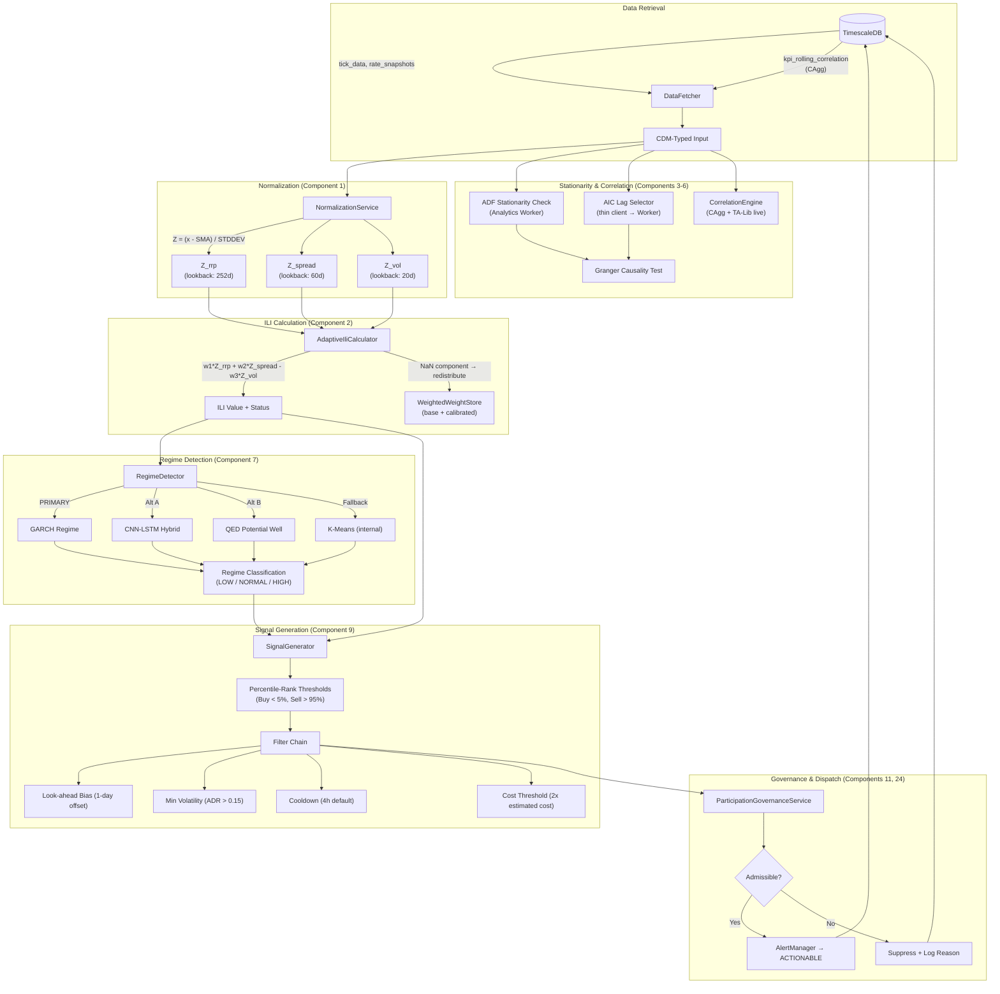

---

## 4. Signal Generation & v5 Extended Modules

How signals flow through v5 enhancements: sentiment, leverage, pairs, stops, and execution analysis.

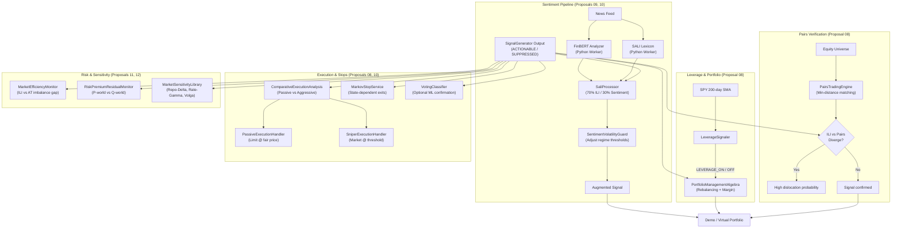

---

## 5. Python Analytics Worker: Service Architecture

Internal service decomposition of the FastAPI analytics worker showing all v5 endpoints.

```mermaid
graph TD
    subgraph "Transport Layer"
        Arrow["Arrow IPC Endpoint<br/>(high-throughput time-series)"]
        REST["REST/JSON Endpoints<br/>(small payloads, config)"]
    end

    subgraph "Econometrics (v1)"
        ADF["/causality<br/>ADF + Granger + AIC"]
        OLS["/econometrics/ols<br/>Full OLS Statistics"]
    end

    subgraph "Anomaly & Drift (v4)"
        Autoenc["/anomaly/detect<br/>PyTorch Autoencoder"]
        Drift["/drift-diffusion<br/>Ito Process Simulation"]
    end

    subgraph "Regime Models (v4)"
        GarchSvc["/risk/garch-regime<br/>GARCH Volatility Regime"]
        DlSvc["/regime/hybrid<br/>CNN-LSTM Ensemble"]
        QedSvc["/regime/qed<br/>Quartic Potential Well"]
        Climate["/climate/simulate<br/>Multi-country Trade"]
    end

    subgraph "Optimization (v4)"
        SgdOpt["/risk/weight-delta<br/>Online SGD Optimizer"]
        SobolSvc["/sobol/simulate<br/>Quasi-random MC"]
        Riemann["/backtest/riemann-zeta<br/>Discrete Monitoring Correction"]
    end

    subgraph "Risk & Liquidity (v4-v5)"
        GexSvc["/risk/greeks-gex<br/>BSM Gamma + GEX"]
        LiqSvc["/liquidity/comovement<br/>PCA + Amihud"]
        ToxSvc["/liquidity/toxicity<br/>Order-to-Trade Ratio"]
    end

    subgraph "Sentiment (v5: Proposal 09)"
        FinSvc["/sentiment/analyze<br/>FinBERT"]
        SaliSvc["/sentiment/lexicon<br/>TextBlob SALI"]
    end

    subgraph "Stops (v5: Proposal 08)"
        StopSvc["/stops/calibrate<br/>Markov Stop Engine"]
    end

    subgraph "Diagnostics & Explainability (v5: Proposal 10-11)"
        DiagSvc["/diagnostics/stats<br/>QQ-plot, ACF, Convergence"]
        VolSvc["/analytics/volatility-forecast<br/>Volatility Projection"]
        TourSvc["/tournament/evaluate<br/>Model Tournament"]
        ShapSvc["/explainability/feature-importance<br/>SHAP Values"]
    end

    subgraph "Fixed Income (v5: Proposal 12)"
        QwSvc["/fixed-income/q-world-fair-value<br/>Q-World Bond Pricer"]
        GkSvc["/fixed-income/tbill-greeks<br/>T-Bill Analytical Greeks"]
        CurveSvc["/strategies/interpolate-curve<br/>Nelson-Siegel / Cubic Spline"]
    end

    Arrow --> ADF & Autoenc & GarchSvc & SgdOpt & FinSvc & DiagSvc & QwSvc
    REST --> OLS & Drift & DlSvc & QedSvc & Climate & SobolSvc & Riemann
    REST --> GexSvc & LiqSvc & ToxSvc & SaliSvc & StopSvc & VolSvc
    REST --> TourSvc & ShapSvc & GkSvc & CurveSvc
```

---

## 6. ILI Calculation Pipeline (Detailed)

Step-by-step flow of the Institutional Liquidity Index calculation with all guardrails.

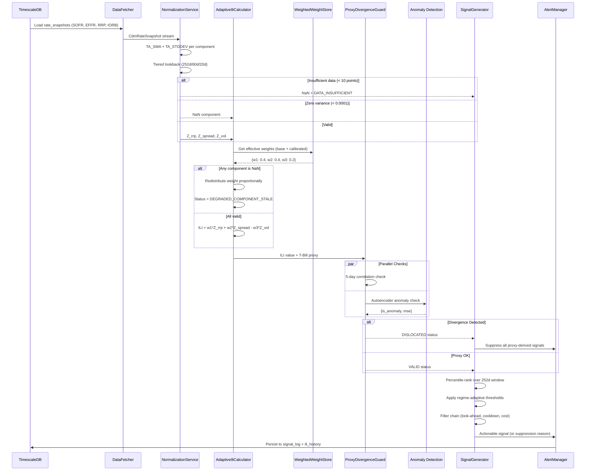

---

## 7. Backtesting Framework Flow

Data flow through the backtesting engine including walk-forward validation and multi-model tournament.

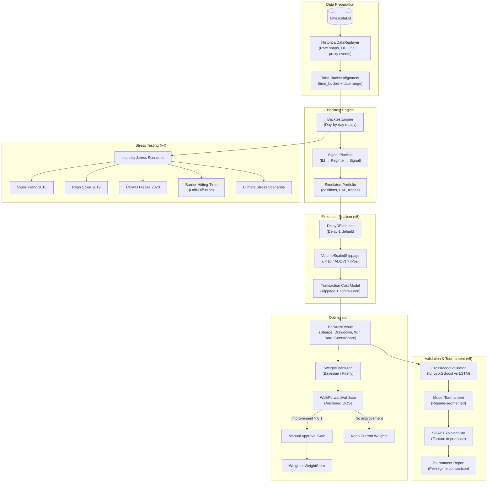

---

## 8. Demo / Virtual Portfolio Flow

End-to-end signal-to-virtual-trade pipeline with dual portfolio comparison.

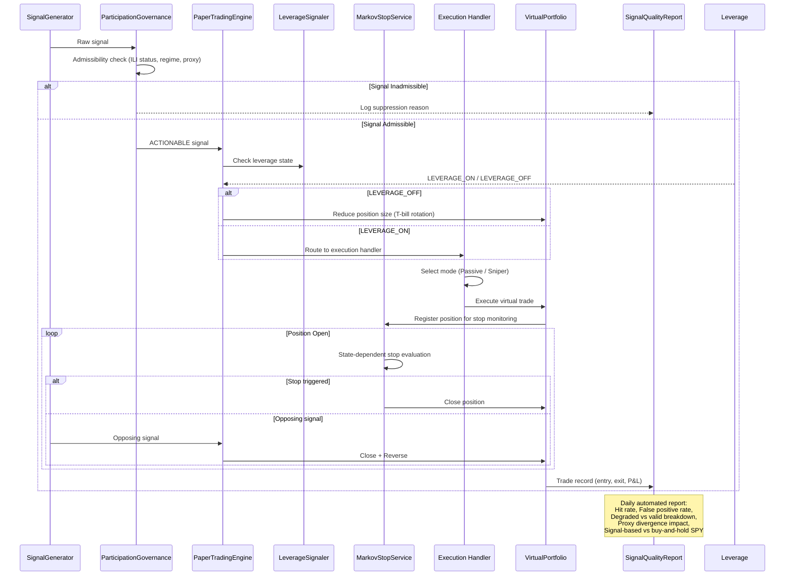

---

## 9. QED Potential Well & State Dynamics (Proposal 03)

State-transition dynamics of the QED (Quantum Economics Dynamics) model.

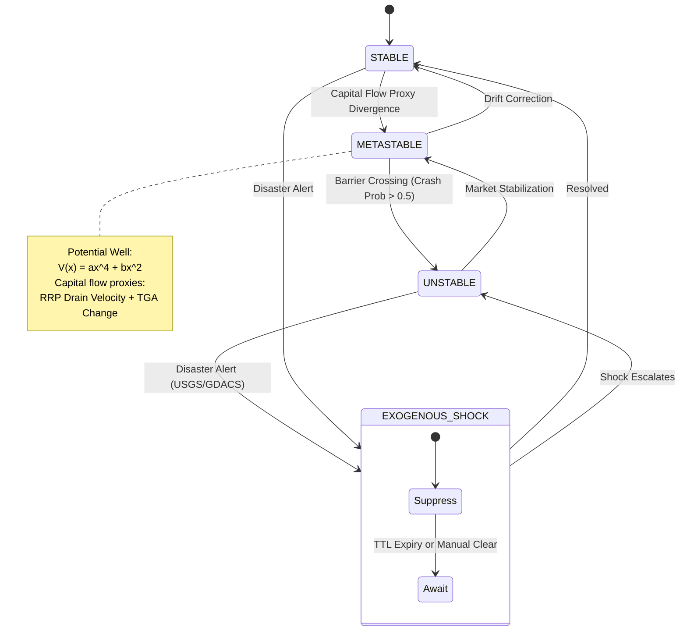

---

## 10. AUMF Uncertainty Management Lifecycle (Proposal 06)

Five-stage uncertainty management framework controlling signal admissibility during crisis periods.

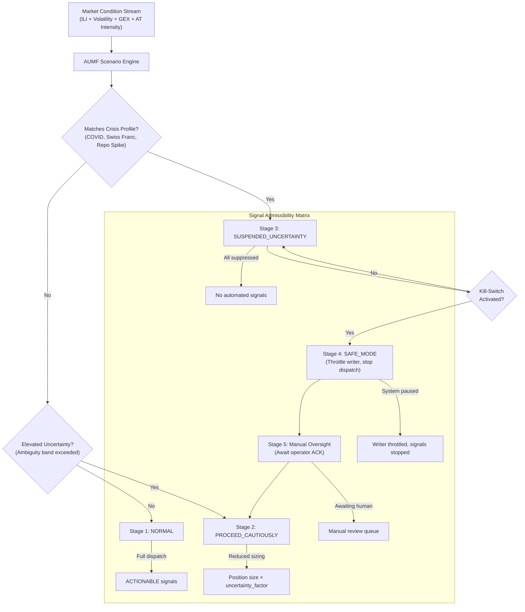

---

## 11. Stochastic Weight Optimization & Calibration Loop

Closed-loop optimization cycle with Bayesian/Firefly meta-heuristics and OOS validation.

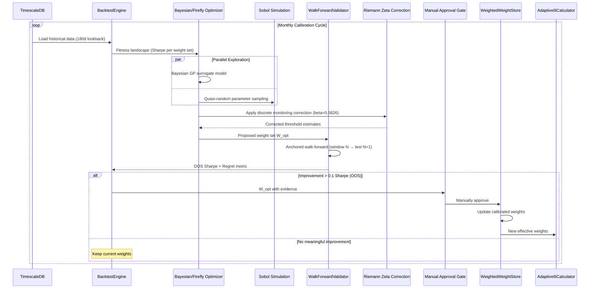

---

## 12. Deployment & Container Architecture

Docker Compose topology showing all services, volumes, and inter-container communication.

```mermaid
graph TD
    subgraph "Docker Compose Environment"
        subgraph "Application Services"
            Backend["Backend (Java 25)<br/>Spring MVC + Virtual Threads<br/>Port: 8080"]
            Worker["Analytics Worker (Python 3.12)<br/>FastAPI + Uvicorn<br/>Port: 8001"]
            Dashboard["Dashboard (Next.js 15)<br/>Nginx<br/>Port: 3000"]
            Landing["Landing Page (Next.js 15)<br/>Nginx<br/>Port: 3001"]
        end

        subgraph "Data Infrastructure"
            TSDB[("TimescaleDB<br/>PG16 + Timescale Extension<br/>Port: 5432")]
            Overflow[("Chronicle Queue<br/>Overflow Volume<br/>(NVMe / tmpfs)")]
        end

        subgraph "Observability (v4)"
            Jaeger["Jaeger<br/>Port: 16686 (UI)<br/>Port: 4317 (OTLP gRPC)"]
        end
    end

    Backend -->|"JDBC"| TSDB
    Backend <==>|Arrow IPC<br/>(Socket)"| Worker
    Backend -->|"Chronicle Queue"| Overflow
    Dashboard -->|"REST + WS"| Backend
    Backend -->|"OTLP"| Jaeger
    Worker -->|"OTLP"| Jaeger

    subgraph "External Free Data Sources"
        FRED["FRED API"]
        NYFed["NY Fed API"]
        YahooFinance["Yahoo Finance"]
        Finnhub["Finnhub"]
        AlphaVantage["Alpha Vantage"]
        DataHub["DataHub (CSV)"]
        KenFrench["Ken French"]
        FedRSS["Fed RSS"]
    end

    Backend -->|"HTTPS"| FRED
    Backend -->|"HTTPS"| NYFed
    Backend -->|"HTTPS REST"| YahooFinance
    Backend -->|"WebSocket + REST"| Finnhub
    Backend -->|"HTTPS REST"| AlphaVantage
    Backend -->|"HTTPS CSV"| DataHub
    Backend -->|"HTTPS CSV"| KenFrench
    Backend -->|"RSS"| FedRSS
```

---

## 13. Dashboard Component Architecture

Frontend component hierarchy showing data sources and WebSocket connections.

```mermaid
graph TD
    subgraph "Data Layer"
        WS1["/ws/signals<br/>(Real-time signals)"]
        WS2["/ws/prices<br/>(Live price updates)"]
        API["REST API<br/>/api/v1/*"]
    end

    subgraph "Core Charts"
        PriceILI["Multi-Pane Chart<br/>Price + ILI + Signal Markers<br/>(Lightweight Charts)"]
        CorrMatrix["Correlation Matrix<br/>(Perspective Heatmap)"]
        SignalLog["Signal Log Grid<br/>(Perspective Data Grid)"]
    end

    subgraph "ILI & KPI Cards"
        ILICard["ILI Card<br/>(value, status, weights)"]
        Freshness["Data Freshness Panel<br/>(FRED, NY Fed, Proxy)"]
        KPIGrid["KPI Dashboard<br/>(LSI, Beta, RRP Velocity, GEX)"]
    end

    subgraph "Risk & Regime Panels"
        RegimePanel["Regime Indicator<br/>(GARCH / CNN-LSTM / QED)"]
        AUMFPanel["AUMF Status<br/>(5-stage uncertainty)"]
        SurprisePanel["Surprise Indicator<br/>(Entropy-based anomaly)"]
    end

    subgraph "v5 Dashboard Extensions"
        SentHeatmap["Sentiment Heatmap<br/>(FinBERT + SALI)"]
        ExecPanel["Execution Comparison<br/>(Passive vs Aggressive)"]
        PairsPanel["Pairs Verification<br/>(Divergence monitor)"]
        LevPanel["Leverage Regime<br/>(ON / OFF indicator)"]
        StopsPanel["Dynamic Stops<br/>(Markov state tracker)"]
        QQPanel["Tail Risk QQ-Plot<br/>(Distribution diagnostics)"]
        ACFPanel["Volatility ACF<br/>(Persistence chart)"]
        ConvPanel["Sample Adequacy<br/>(Convergence monitor)"]
        EffPanel["Market Efficiency Gap<br/>(ILI vs AT imbalance)"]
        MpsPanel["Monetary Policy<br/>Sensitivity"]
        TourPanel["Model Tournament<br/>(ILI vs ML comparison)"]
        GreeksPanel["Greeks Sensitivity<br/>(Repo-Delta, Rate-Gamma, Volga)"]
    end

    subgraph "Backtest & Demo"
        BTEquity["Backtest Equity Curve"]
        BTDrawdown["Drawdown Chart"]
        BTSigTimeline["Signal Timeline"]
        BTCompare["Parameter Comparison"]
        DemoPort["Demo Portfolio<br/>(P&L, trades, win rate)"]
        SignalReport["Signal Quality Report"]
    end

    WS1 --> PriceILI & SignalLog & SentHeatmap & RegimePanel & AUMFPanel
    WS2 --> PriceILI & DemoPort
    API --> ILICard & Freshness & KPIGrid & CorrMatrix
    API --> ExecPanel & PairsPanel & LevPanel & StopsPanel
    API --> QQPanel & ACFPanel & ConvPanel & EffPanel & MpsPanel
    API --> TourPanel & GreeksPanel
    API --> BTEquity & BTDrawdown & BTSigTimeline & BTCompare
    API --> SignalReport
```

---

## v6 Changelog

- **Title:** Updated from "v5" to "v6" to reflect current architecture version.
- **Section 1 (System Topology):** Replaced single `Polygon.io` data source node with separate nodes: `Yahoo Finance`, `Finnhub`, `Alpha Vantage`, `DataHub`, `Ken French`, `Fed RSS`. Removed `OpenBB` node. Updated ingestion clients accordingly (added `YahooFinanceClient`, renamed `PolygonWs` to `FinnhubWs`).
- **Section 2 (Ingestion Sequence):** Updated participant name from `Fred/NyFed/Polygon` to `Fred/NyFed/Finnhub` reflecting free data source migration.
- **Section 12 (Deployment):** Removed `OpenBB Platform` sidecar subgraph. Replaced external `Polygon.io` with separate `Yahoo Finance`, `Finnhub`, `Alpha Vantage`, `DataHub`, `Ken French`, `Fed RSS` nodes. Updated connection labels from "REST (equity)" and "WebSocket + REST" to appropriate free data source protocols.
- **All data flow descriptions:** References to "Polygon" updated to "Finnhub" where applicable. References to "OpenBB sidecar" updated to "Free data source clients".
